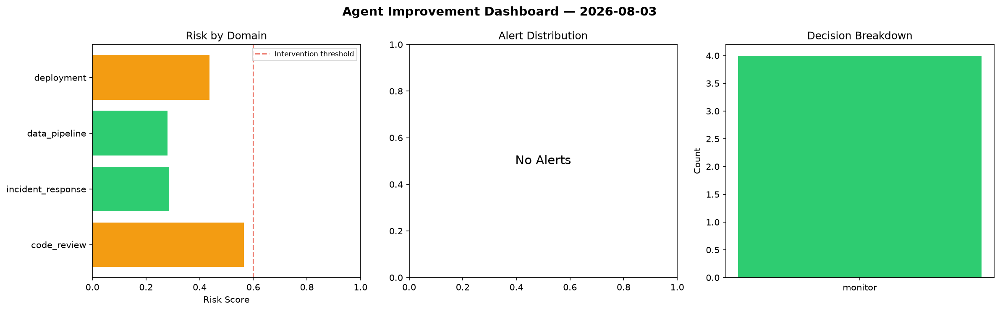
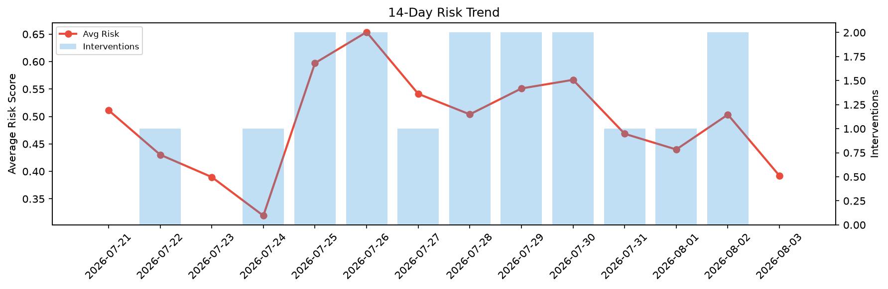

# Agent Improvement Report — 2026-08-03

**Cycle ID:** `0669b473` | **Avg Risk:** 0.392 | **Interventions:** 0/4

## Risk Matrix

| Domain | Risk Score | Decision | Alerts |
|--------|-----------|----------|--------|
| code_review | 0.5649 | monitor | none |
| incident_response | 0.2865 | monitor | none |
| data_pipeline | 0.2795 | monitor | none |
| deployment | 0.4371 | monitor | none |

## Delta vs Yesterday

| Domain | Today | Yesterday | Change |
|--------|-------|-----------|--------|
| code_review | 0.5649 | 0.6537 | 📉 -13.6% |
| incident_response | 0.2865 | 0.5554 | 📉 -48.4% |
| data_pipeline | 0.2795 | 0.6958 | 📉 -59.8% |
| deployment | 0.4371 | 0.1091 | 📈 300.6% |

**Refinement:** `{'adjustment': 'maintain', 'trend': 'improving', 'window': 4}`