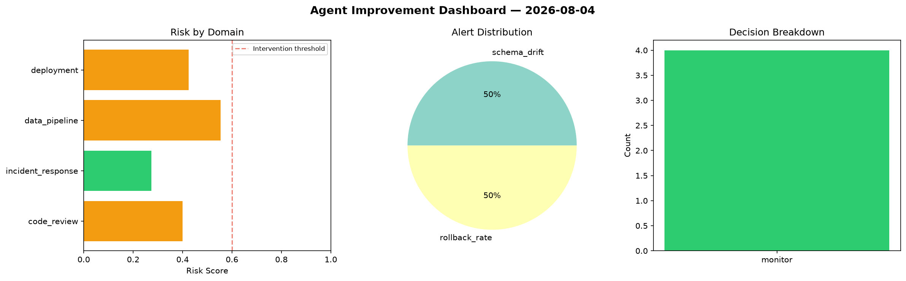
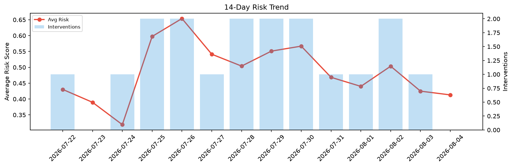

# Agent Improvement Report — 2026-08-04

**Cycle ID:** `a06a58cc` | **Avg Risk:** 0.413 | **Interventions:** 0/4

## Risk Matrix

| Domain | Risk Score | Decision | Alerts |
|--------|-----------|----------|--------|
| code_review | 0.4004 | monitor | none |
| incident_response | 0.2732 | monitor | none |
| data_pipeline | 0.554 | monitor | schema_drift |
| deployment | 0.4245 | monitor | rollback_rate |

## Delta vs Yesterday

| Domain | Today | Yesterday | Change |
|--------|-------|-----------|--------|
| code_review | 0.4004 | 0.4307 | 📉 -7.0% |
| incident_response | 0.2732 | 0.1597 | 📈 71.1% |
| data_pipeline | 0.554 | 0.6513 | 📉 -14.9% |
| deployment | 0.4245 | 0.4579 | 📉 -7.3% |

**Refinement:** `{'adjustment': 'tighten_thresholds', 'trend': 'degrading', 'window': 4}`