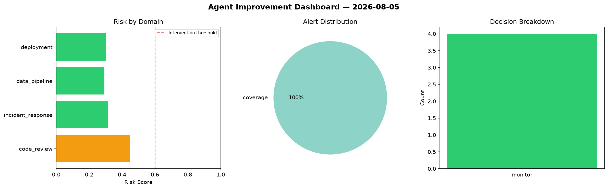
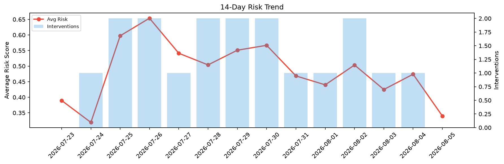

# Agent Improvement Report — 2026-08-05

**Cycle ID:** `532a2af0` | **Avg Risk:** 0.3397 | **Interventions:** 0/4

## Risk Matrix

| Domain | Risk Score | Decision | Alerts |
|--------|-----------|----------|--------|
| code_review | 0.4472 | monitor | coverage |
| incident_response | 0.3152 | monitor | none |
| data_pipeline | 0.293 | monitor | none |
| deployment | 0.3035 | monitor | none |

## Delta vs Yesterday

| Domain | Today | Yesterday | Change |
|--------|-------|-----------|--------|
| code_review | 0.4472 | 0.7073 | 📉 -36.8% |
| incident_response | 0.3152 | 0.4494 | 📉 -29.9% |
| data_pipeline | 0.293 | 0.2941 | 📉 -0.4% |
| deployment | 0.3035 | 0.4453 | 📉 -31.8% |

**Refinement:** `{'adjustment': 'maintain', 'trend': 'improving', 'window': 4}`