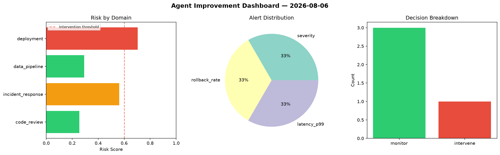
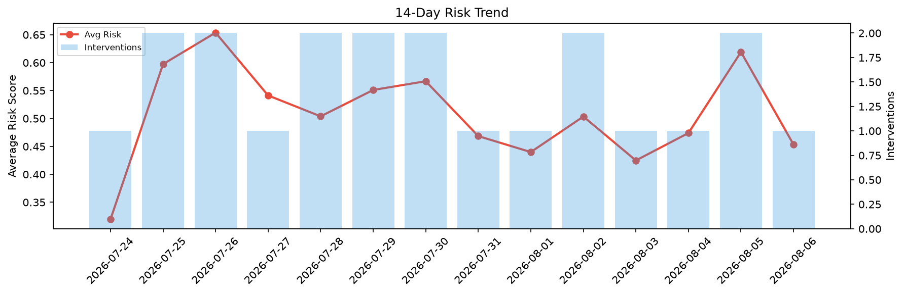

# Agent Improvement Report — 2026-08-06

**Cycle ID:** `9f2e06e4` | **Avg Risk:** 0.4534 | **Interventions:** 1/4

## Risk Matrix

| Domain | Risk Score | Decision | Alerts |
|--------|-----------|----------|--------|
| code_review | 0.2551 | monitor | none |
| incident_response | 0.5622 | monitor | severity |
| data_pipeline | 0.2925 | monitor | none |
| deployment | 0.7037 | intervene | rollback_rate, latency_p99 |

## Delta vs Yesterday

| Domain | Today | Yesterday | Change |
|--------|-------|-----------|--------|
| code_review | 0.2551 | 0.3914 | 📉 -34.8% |
| incident_response | 0.5622 | 0.7612 | 📉 -26.1% |
| data_pipeline | 0.2925 | 0.7381 | 📉 -60.4% |
| deployment | 0.7037 | 0.5859 | 📈 20.1% |

**Refinement:** `{'adjustment': 'tighten_thresholds', 'trend': 'degrading', 'window': 4}`