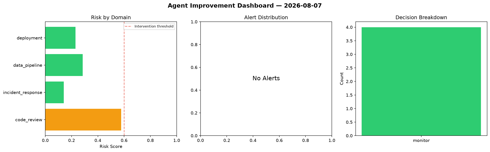
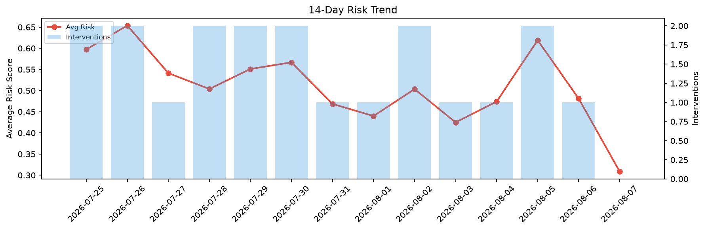

# Agent Improvement Report — 2026-08-07

**Cycle ID:** `46667974` | **Avg Risk:** 0.3084 | **Interventions:** 0/4

## Risk Matrix

| Domain | Risk Score | Decision | Alerts |
|--------|-----------|----------|--------|
| code_review | 0.5782 | monitor | none |
| incident_response | 0.1409 | monitor | none |
| data_pipeline | 0.2849 | monitor | none |
| deployment | 0.2295 | monitor | none |

## Delta vs Yesterday

| Domain | Today | Yesterday | Change |
|--------|-------|-----------|--------|
| code_review | 0.5782 | 0.3114 | 📈 85.7% |
| incident_response | 0.1409 | 0.6364 | 📉 -77.9% |
| data_pipeline | 0.2849 | 0.5749 | 📉 -50.4% |
| deployment | 0.2295 | 0.4017 | 📉 -42.9% |

**Refinement:** `{'adjustment': 'maintain', 'trend': 'improving', 'window': 4}`