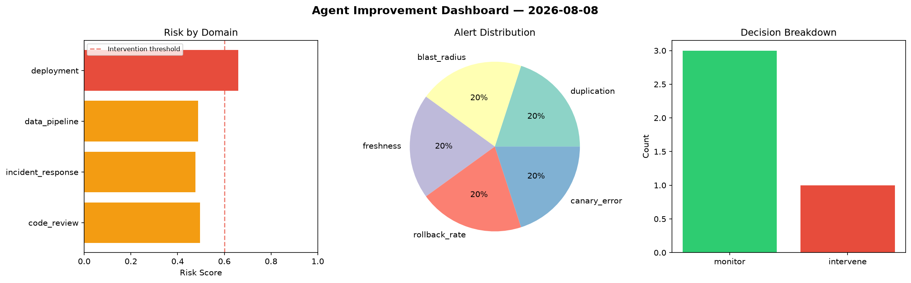
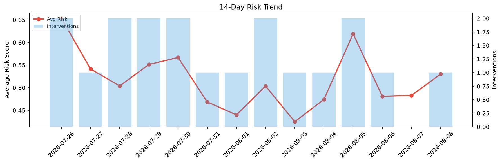

# Agent Improvement Report — 2026-08-08

**Cycle ID:** `2d3fe1f2` | **Avg Risk:** 0.5301 | **Interventions:** 1/4

## Risk Matrix

| Domain | Risk Score | Decision | Alerts |
|--------|-----------|----------|--------|
| code_review | 0.4964 | monitor | duplication |
| incident_response | 0.4765 | monitor | blast_radius |
| data_pipeline | 0.488 | monitor | freshness |
| deployment | 0.6596 | intervene | rollback_rate, canary_error |

## Delta vs Yesterday

| Domain | Today | Yesterday | Change |
|--------|-------|-----------|--------|
| code_review | 0.4964 | 0.365 | 📈 36.0% |
| incident_response | 0.4765 | 0.4429 | 📈 7.6% |
| data_pipeline | 0.488 | 0.5596 | 📉 -12.8% |
| deployment | 0.6596 | 0.5639 | 📈 17.0% |

**Refinement:** `{'adjustment': 'tighten_thresholds', 'trend': 'degrading', 'window': 4}`