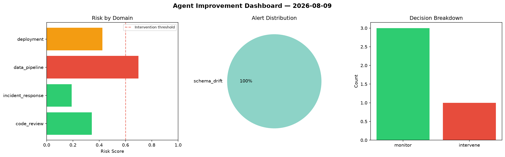
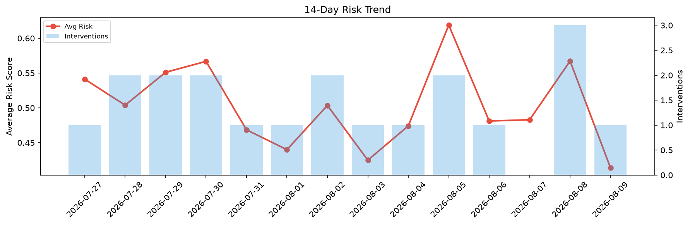

# Agent Improvement Report — 2026-08-09

**Cycle ID:** `3b77c034` | **Avg Risk:** 0.4137 | **Interventions:** 1/4

## Risk Matrix

| Domain | Risk Score | Decision | Alerts |
|--------|-----------|----------|--------|
| code_review | 0.3432 | monitor | none |
| incident_response | 0.1902 | monitor | none |
| data_pipeline | 0.6976 | intervene | schema_drift |
| deployment | 0.4238 | monitor | none |

## Delta vs Yesterday

| Domain | Today | Yesterday | Change |
|--------|-------|-----------|--------|
| code_review | 0.3432 | 0.3267 | 📈 5.1% |
| incident_response | 0.1902 | 0.6056 | 📉 -68.6% |
| data_pipeline | 0.6976 | 0.6975 | ➡️ 0.0% |
| deployment | 0.4238 | 0.6393 | 📉 -33.7% |

**Refinement:** `{'adjustment': 'tighten_thresholds', 'trend': 'degrading', 'window': 4}`