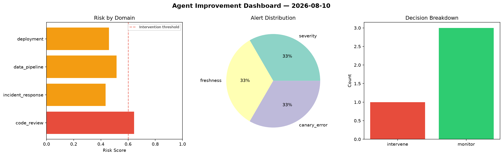
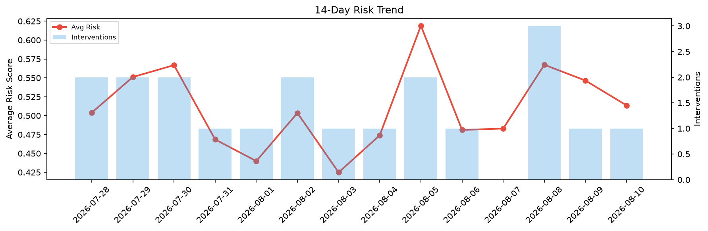

# Agent Improvement Report — 2026-08-10

**Cycle ID:** `c5e6ec45` | **Avg Risk:** 0.5135 | **Interventions:** 1/4

## Risk Matrix

| Domain | Risk Score | Decision | Alerts |
|--------|-----------|----------|--------|
| code_review | 0.6445 | intervene | none |
| incident_response | 0.4349 | monitor | severity |
| data_pipeline | 0.5154 | monitor | freshness |
| deployment | 0.4591 | monitor | canary_error |

## Delta vs Yesterday

| Domain | Today | Yesterday | Change |
|--------|-------|-----------|--------|
| code_review | 0.6445 | 0.8067 | 📉 -20.1% |
| incident_response | 0.4349 | 0.4383 | 📉 -0.8% |
| data_pipeline | 0.5154 | 0.3794 | 📈 35.8% |
| deployment | 0.4591 | 0.561 | 📉 -18.2% |

**Refinement:** `{'adjustment': 'maintain', 'trend': 'improving', 'window': 4}`