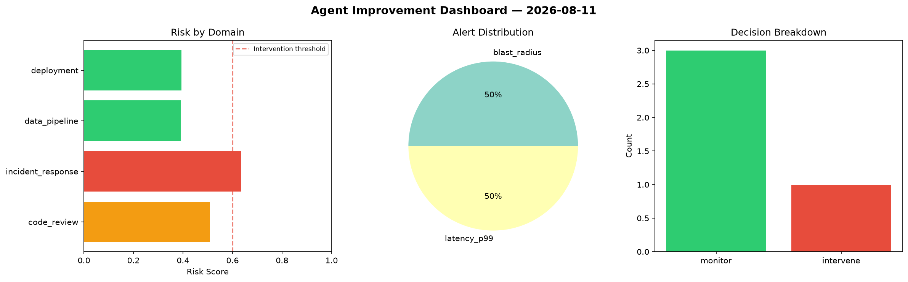
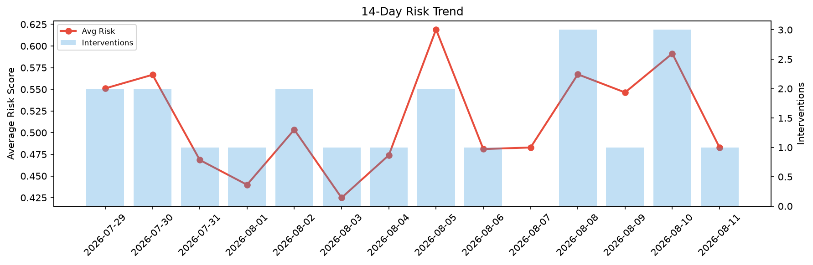

# Agent Improvement Report — 2026-08-11

**Cycle ID:** `f8456cb4` | **Avg Risk:** 0.4828 | **Interventions:** 1/4

## Risk Matrix

| Domain | Risk Score | Decision | Alerts |
|--------|-----------|----------|--------|
| code_review | 0.5092 | monitor | none |
| incident_response | 0.636 | intervene | blast_radius |
| data_pipeline | 0.3913 | monitor | none |
| deployment | 0.3946 | monitor | latency_p99 |

## Delta vs Yesterday

| Domain | Today | Yesterday | Change |
|--------|-------|-----------|--------|
| code_review | 0.5092 | 0.6321 | 📉 -19.4% |
| incident_response | 0.636 | 0.6121 | 📈 3.9% |
| data_pipeline | 0.3913 | 0.4778 | 📉 -18.1% |
| deployment | 0.3946 | 0.6432 | 📉 -38.7% |

**Refinement:** `{'adjustment': 'maintain', 'trend': 'improving', 'window': 4}`