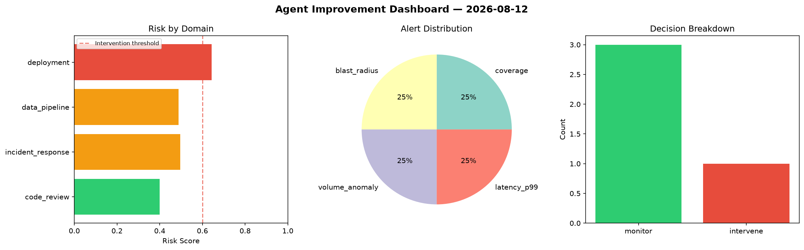
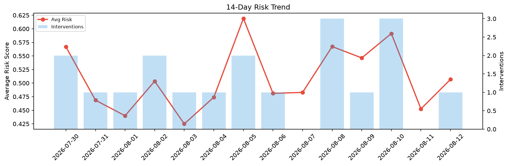

# Agent Improvement Report — 2026-08-12

**Cycle ID:** `caa5beb9` | **Avg Risk:** 0.5069 | **Interventions:** 1/4

## Risk Matrix

| Domain | Risk Score | Decision | Alerts |
|--------|-----------|----------|--------|
| code_review | 0.3997 | monitor | coverage |
| incident_response | 0.497 | monitor | blast_radius |
| data_pipeline | 0.4876 | monitor | volume_anomaly |
| deployment | 0.6432 | intervene | latency_p99 |

## Delta vs Yesterday

| Domain | Today | Yesterday | Change |
|--------|-------|-----------|--------|
| code_review | 0.3997 | 0.3434 | 📈 16.4% |
| incident_response | 0.497 | 0.4841 | 📈 2.7% |
| data_pipeline | 0.4876 | 0.5155 | 📉 -5.4% |
| deployment | 0.6432 | 0.4669 | 📈 37.8% |

**Refinement:** `{'adjustment': 'tighten_thresholds', 'trend': 'degrading', 'window': 4}`