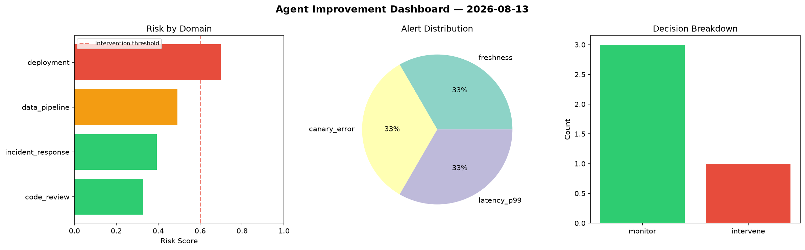
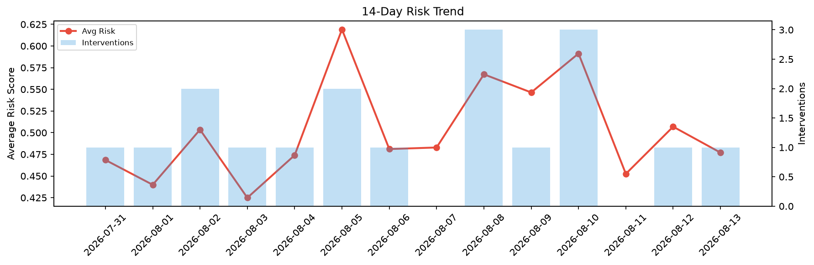

# Agent Improvement Report — 2026-08-13

**Cycle ID:** `9398a586` | **Avg Risk:** 0.477 | **Interventions:** 1/4

## Risk Matrix

| Domain | Risk Score | Decision | Alerts |
|--------|-----------|----------|--------|
| code_review | 0.327 | monitor | none |
| incident_response | 0.3926 | monitor | none |
| data_pipeline | 0.4911 | monitor | freshness |
| deployment | 0.6973 | intervene | canary_error, latency_p99 |

## Delta vs Yesterday

| Domain | Today | Yesterday | Change |
|--------|-------|-----------|--------|
| code_review | 0.327 | 0.3997 | 📉 -18.2% |
| incident_response | 0.3926 | 0.497 | 📉 -21.0% |
| data_pipeline | 0.4911 | 0.4876 | 📈 0.7% |
| deployment | 0.6973 | 0.6432 | 📈 8.4% |

**Refinement:** `{'adjustment': 'tighten_thresholds', 'trend': 'degrading', 'window': 4}`