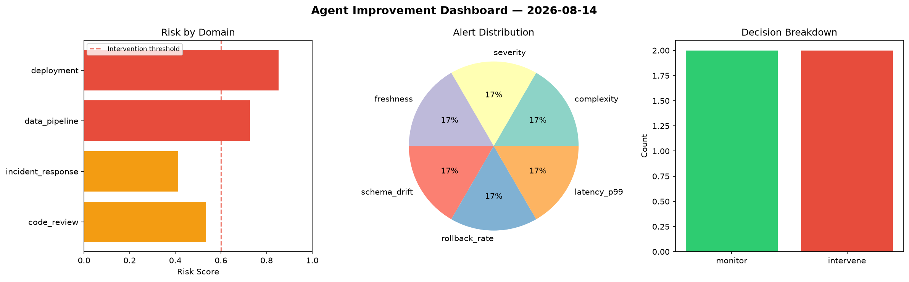
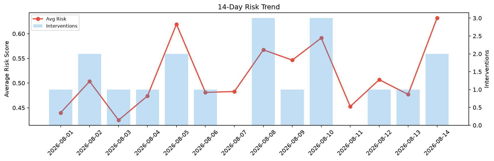

# Agent Improvement Report — 2026-08-14

**Cycle ID:** `24429fcf` | **Avg Risk:** 0.632 | **Interventions:** 2/4

## Risk Matrix

| Domain | Risk Score | Decision | Alerts |
|--------|-----------|----------|--------|
| code_review | 0.5349 | monitor | complexity |
| incident_response | 0.4129 | monitor | severity |
| data_pipeline | 0.7275 | intervene | freshness, schema_drift |
| deployment | 0.8527 | intervene | rollback_rate, latency_p99 |

## Delta vs Yesterday

| Domain | Today | Yesterday | Change |
|--------|-------|-----------|--------|
| code_review | 0.5349 | 0.327 | 📈 63.6% |
| incident_response | 0.4129 | 0.3926 | 📈 5.2% |
| data_pipeline | 0.7275 | 0.4911 | 📈 48.1% |
| deployment | 0.8527 | 0.6973 | 📈 22.3% |

**Refinement:** `{'adjustment': 'tighten_thresholds', 'trend': 'degrading', 'window': 4}`