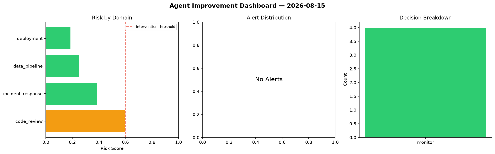
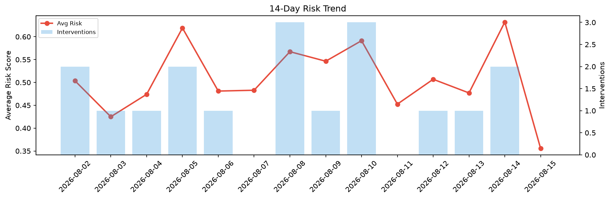

# Agent Improvement Report — 2026-08-15

**Cycle ID:** `c65f0f7b` | **Avg Risk:** 0.3554 | **Interventions:** 0/4

## Risk Matrix

| Domain | Risk Score | Decision | Alerts |
|--------|-----------|----------|--------|
| code_review | 0.5949 | monitor | none |
| incident_response | 0.3874 | monitor | none |
| data_pipeline | 0.2538 | monitor | none |
| deployment | 0.1855 | monitor | none |

## Delta vs Yesterday

| Domain | Today | Yesterday | Change |
|--------|-------|-----------|--------|
| code_review | 0.5949 | 0.5349 | 📈 11.2% |
| incident_response | 0.3874 | 0.4129 | 📉 -6.2% |
| data_pipeline | 0.2538 | 0.7275 | 📉 -65.1% |
| deployment | 0.1855 | 0.8527 | 📉 -78.2% |

**Refinement:** `{'adjustment': 'maintain', 'trend': 'improving', 'window': 4}`