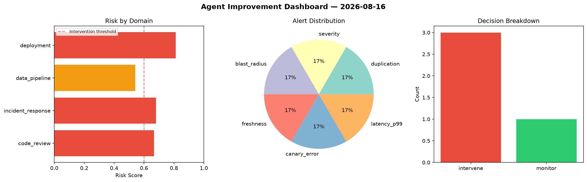
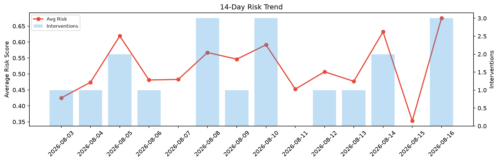

# Agent Improvement Report — 2026-08-16

**Cycle ID:** `1ff7a52b` | **Avg Risk:** 0.6754 | **Interventions:** 3/4

## Risk Matrix

| Domain | Risk Score | Decision | Alerts |
|--------|-----------|----------|--------|
| code_review | 0.667 | intervene | duplication |
| incident_response | 0.6808 | intervene | severity, blast_radius |
| data_pipeline | 0.5425 | monitor | freshness |
| deployment | 0.8113 | intervene | canary_error, latency_p99 |

## Delta vs Yesterday

| Domain | Today | Yesterday | Change |
|--------|-------|-----------|--------|
| code_review | 0.667 | 0.4102 | 📈 62.6% |
| incident_response | 0.6808 | 0.3208 | 📈 112.2% |
| data_pipeline | 0.5425 | 0.2854 | 📈 90.1% |
| deployment | 0.8113 | 0.3952 | 📈 105.3% |

**Refinement:** `{'adjustment': 'tighten_thresholds', 'trend': 'degrading', 'window': 4}`