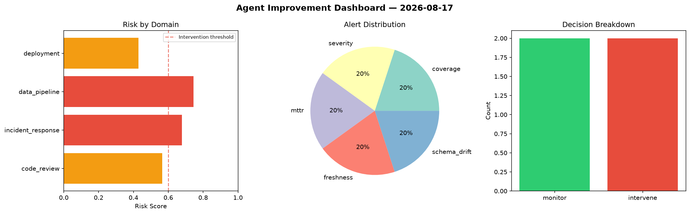
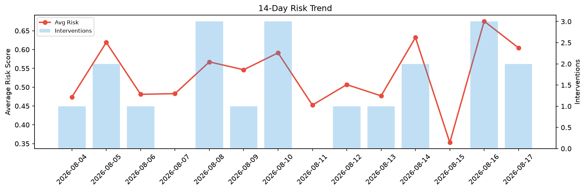

# Agent Improvement Report — 2026-08-17

**Cycle ID:** `fa2a16eb` | **Avg Risk:** 0.6046 | **Interventions:** 2/4

## Risk Matrix

| Domain | Risk Score | Decision | Alerts |
|--------|-----------|----------|--------|
| code_review | 0.5658 | monitor | coverage |
| incident_response | 0.6784 | intervene | severity, mttr |
| data_pipeline | 0.745 | intervene | freshness, schema_drift |
| deployment | 0.4291 | monitor | none |

## Delta vs Yesterday

| Domain | Today | Yesterday | Change |
|--------|-------|-----------|--------|
| code_review | 0.5658 | 0.667 | 📉 -15.2% |
| incident_response | 0.6784 | 0.6808 | 📉 -0.4% |
| data_pipeline | 0.745 | 0.5425 | 📈 37.3% |
| deployment | 0.4291 | 0.8113 | 📉 -47.1% |

**Refinement:** `{'adjustment': 'maintain', 'trend': 'improving', 'window': 4}`