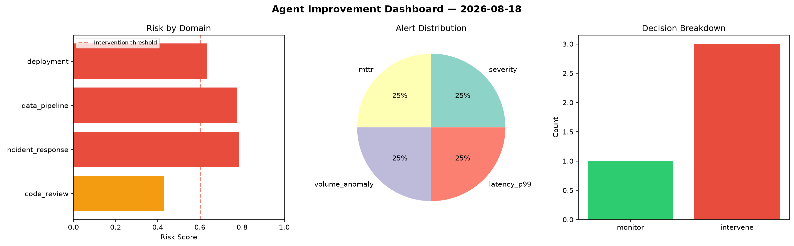
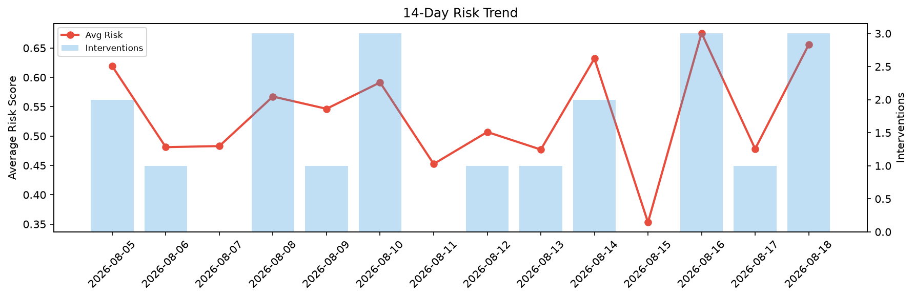

# Agent Improvement Report — 2026-08-18

**Cycle ID:** `a1dda1f5` | **Avg Risk:** 0.6558 | **Interventions:** 3/4

## Risk Matrix

| Domain | Risk Score | Decision | Alerts |
|--------|-----------|----------|--------|
| code_review | 0.4293 | monitor | none |
| incident_response | 0.7869 | intervene | severity, mttr |
| data_pipeline | 0.775 | intervene | volume_anomaly |
| deployment | 0.6319 | intervene | latency_p99 |

## Delta vs Yesterday

| Domain | Today | Yesterday | Change |
|--------|-------|-----------|--------|
| code_review | 0.4293 | 0.4701 | 📉 -8.7% |
| incident_response | 0.7869 | 0.3464 | 📈 127.2% |
| data_pipeline | 0.775 | 0.6067 | 📈 27.7% |
| deployment | 0.6319 | 0.4893 | 📈 29.1% |

**Refinement:** `{'adjustment': 'tighten_thresholds', 'trend': 'degrading', 'window': 4}`