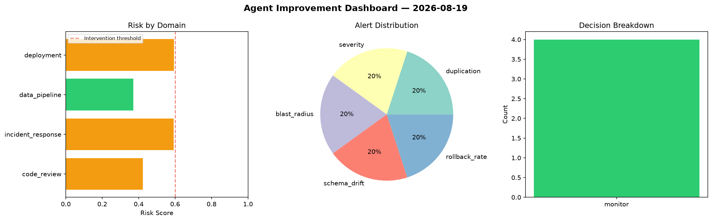
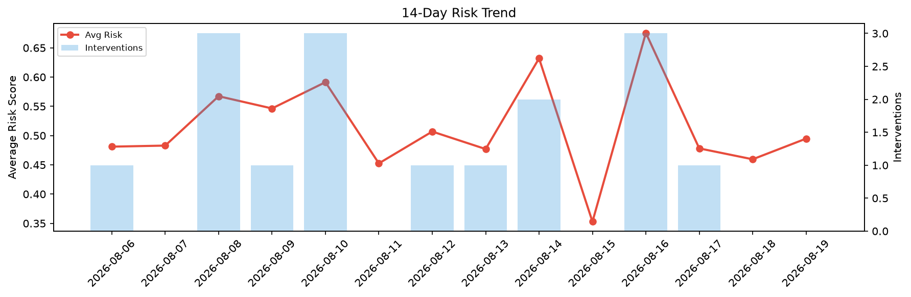

# Agent Improvement Report — 2026-08-19

**Cycle ID:** `5d278e15` | **Avg Risk:** 0.4948 | **Interventions:** 0/4

## Risk Matrix

| Domain | Risk Score | Decision | Alerts |
|--------|-----------|----------|--------|
| code_review | 0.423 | monitor | duplication |
| incident_response | 0.5918 | monitor | severity, blast_radius |
| data_pipeline | 0.3709 | monitor | schema_drift |
| deployment | 0.5933 | monitor | rollback_rate |

## Delta vs Yesterday

| Domain | Today | Yesterday | Change |
|--------|-------|-----------|--------|
| code_review | 0.423 | 0.5808 | 📉 -27.2% |
| incident_response | 0.5918 | 0.2387 | 📈 147.9% |
| data_pipeline | 0.3709 | 0.4437 | 📉 -16.4% |
| deployment | 0.5933 | 0.5747 | 📈 3.2% |

**Refinement:** `{'adjustment': 'tighten_thresholds', 'trend': 'degrading', 'window': 4}`