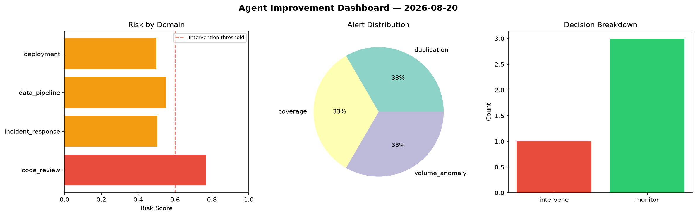
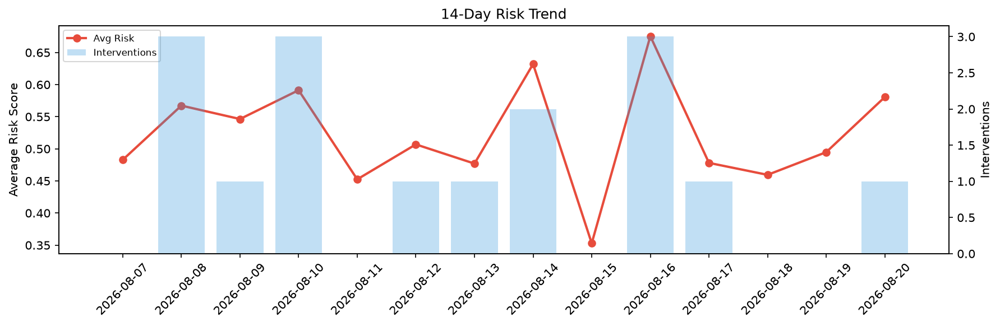

# Agent Improvement Report — 2026-08-20

**Cycle ID:** `6bce21f9` | **Avg Risk:** 0.5806 | **Interventions:** 1/4

## Risk Matrix

| Domain | Risk Score | Decision | Alerts |
|--------|-----------|----------|--------|
| code_review | 0.7686 | intervene | duplication, coverage |
| incident_response | 0.5041 | monitor | none |
| data_pipeline | 0.5509 | monitor | volume_anomaly |
| deployment | 0.4987 | monitor | none |

## Delta vs Yesterday

| Domain | Today | Yesterday | Change |
|--------|-------|-----------|--------|
| code_review | 0.7686 | 0.423 | 📈 81.7% |
| incident_response | 0.5041 | 0.5918 | 📉 -14.8% |
| data_pipeline | 0.5509 | 0.3709 | 📈 48.5% |
| deployment | 0.4987 | 0.5933 | 📉 -15.9% |

**Refinement:** `{'adjustment': 'maintain', 'trend': 'improving', 'window': 4}`