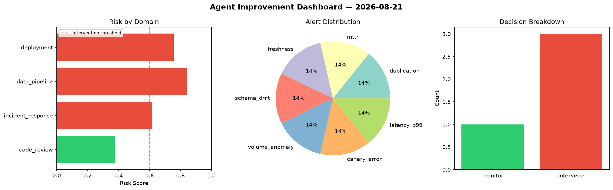
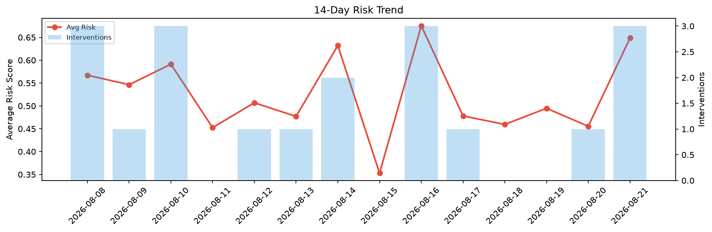

# Agent Improvement Report — 2026-08-21

**Cycle ID:** `5e34b257` | **Avg Risk:** 0.6485 | **Interventions:** 3/4

## Risk Matrix

| Domain | Risk Score | Decision | Alerts |
|--------|-----------|----------|--------|
| code_review | 0.3778 | monitor | duplication |
| incident_response | 0.6189 | intervene | mttr |
| data_pipeline | 0.8405 | intervene | freshness, schema_drift, volume_anomaly |
| deployment | 0.7566 | intervene | canary_error, latency_p99 |

## Delta vs Yesterday

| Domain | Today | Yesterday | Change |
|--------|-------|-----------|--------|
| code_review | 0.3778 | 0.4187 | 📉 -9.8% |
| incident_response | 0.6189 | 0.6472 | 📉 -4.4% |
| data_pipeline | 0.8405 | 0.5349 | 📈 57.1% |
| deployment | 0.7566 | 0.2208 | 📈 242.7% |

**Refinement:** `{'adjustment': 'tighten_thresholds', 'trend': 'degrading', 'window': 4}`