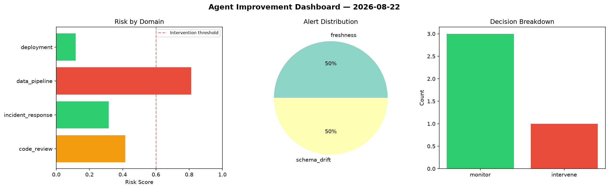
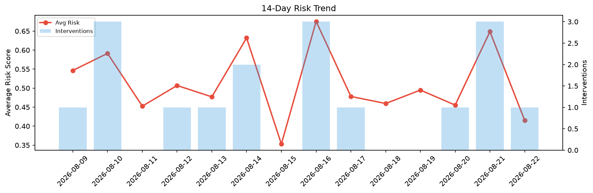

# Agent Improvement Report — 2026-08-22

**Cycle ID:** `824cb755` | **Avg Risk:** 0.4151 | **Interventions:** 1/4

## Risk Matrix

| Domain | Risk Score | Decision | Alerts |
|--------|-----------|----------|--------|
| code_review | 0.4148 | monitor | none |
| incident_response | 0.3155 | monitor | none |
| data_pipeline | 0.813 | intervene | freshness, schema_drift |
| deployment | 0.1171 | monitor | none |

## Delta vs Yesterday

| Domain | Today | Yesterday | Change |
|--------|-------|-----------|--------|
| code_review | 0.4148 | 0.3778 | 📈 9.8% |
| incident_response | 0.3155 | 0.6189 | 📉 -49.0% |
| data_pipeline | 0.813 | 0.8405 | 📉 -3.3% |
| deployment | 0.1171 | 0.7566 | 📉 -84.5% |

**Refinement:** `{'adjustment': 'maintain', 'trend': 'improving', 'window': 4}`