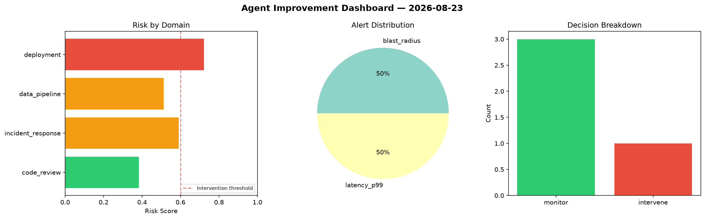
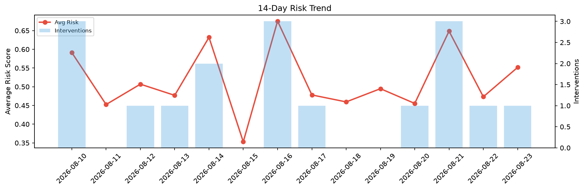

# Agent Improvement Report — 2026-08-23

**Cycle ID:** `8d81eae1` | **Avg Risk:** 0.5517 | **Interventions:** 1/4

## Risk Matrix

| Domain | Risk Score | Decision | Alerts |
|--------|-----------|----------|--------|
| code_review | 0.3831 | monitor | none |
| incident_response | 0.5903 | monitor | blast_radius |
| data_pipeline | 0.5122 | monitor | none |
| deployment | 0.7212 | intervene | latency_p99 |

## Delta vs Yesterday

| Domain | Today | Yesterday | Change |
|--------|-------|-----------|--------|
| code_review | 0.3831 | 0.4906 | 📉 -21.9% |
| incident_response | 0.5903 | 0.337 | 📈 75.2% |
| data_pipeline | 0.5122 | 0.6645 | 📉 -22.9% |
| deployment | 0.7212 | 0.4008 | 📈 79.9% |

**Refinement:** `{'adjustment': 'tighten_thresholds', 'trend': 'degrading', 'window': 4}`