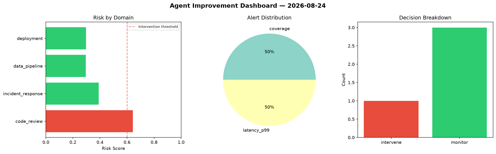
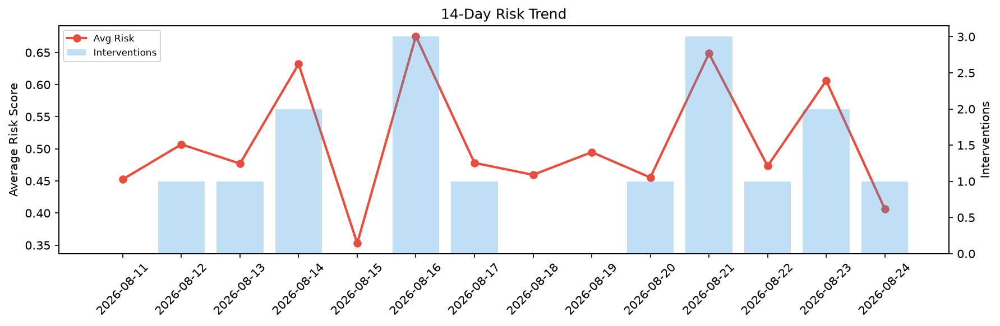

# Agent Improvement Report — 2026-08-24

**Cycle ID:** `af97b36f` | **Avg Risk:** 0.4064 | **Interventions:** 1/4

## Risk Matrix

| Domain | Risk Score | Decision | Alerts |
|--------|-----------|----------|--------|
| code_review | 0.6427 | intervene | coverage |
| incident_response | 0.3908 | monitor | none |
| data_pipeline | 0.2954 | monitor | none |
| deployment | 0.2966 | monitor | latency_p99 |

## Delta vs Yesterday

| Domain | Today | Yesterday | Change |
|--------|-------|-----------|--------|
| code_review | 0.6427 | 0.7978 | 📉 -19.4% |
| incident_response | 0.3908 | 0.5116 | 📉 -23.6% |
| data_pipeline | 0.2954 | 0.4598 | 📉 -35.8% |
| deployment | 0.2966 | 0.6552 | 📉 -54.7% |

**Refinement:** `{'adjustment': 'maintain', 'trend': 'improving', 'window': 4}`