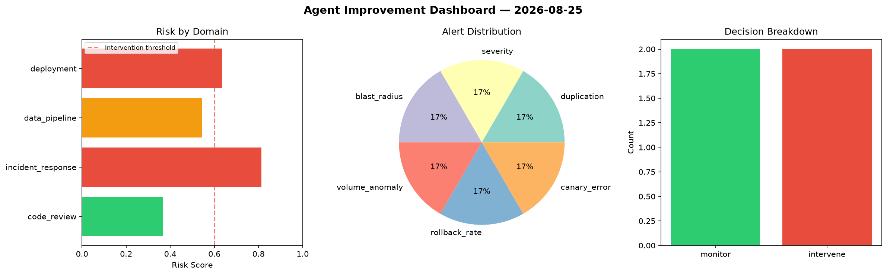
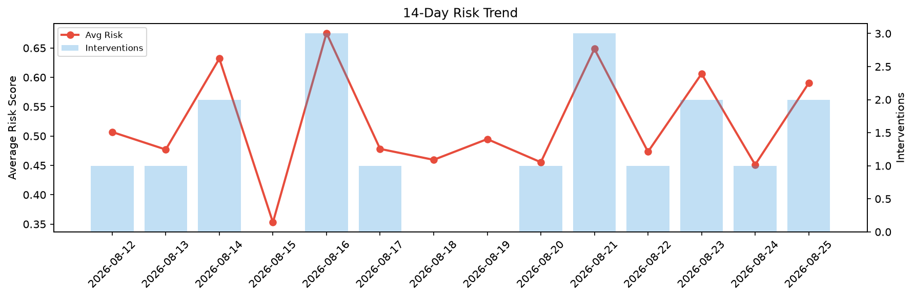

# Agent Improvement Report — 2026-08-25

**Cycle ID:** `c77645ba` | **Avg Risk:** 0.5902 | **Interventions:** 2/4

## Risk Matrix

| Domain | Risk Score | Decision | Alerts |
|--------|-----------|----------|--------|
| code_review | 0.368 | monitor | duplication |
| incident_response | 0.8133 | intervene | severity, blast_radius |
| data_pipeline | 0.5447 | monitor | volume_anomaly |
| deployment | 0.6349 | intervene | rollback_rate, canary_error |

## Delta vs Yesterday

| Domain | Today | Yesterday | Change |
|--------|-------|-----------|--------|
| code_review | 0.368 | 0.1948 | 📈 88.9% |
| incident_response | 0.8133 | 0.7263 | 📈 12.0% |
| data_pipeline | 0.5447 | 0.4352 | 📈 25.2% |
| deployment | 0.6349 | 0.4487 | 📈 41.5% |

**Refinement:** `{'adjustment': 'tighten_thresholds', 'trend': 'degrading', 'window': 4}`