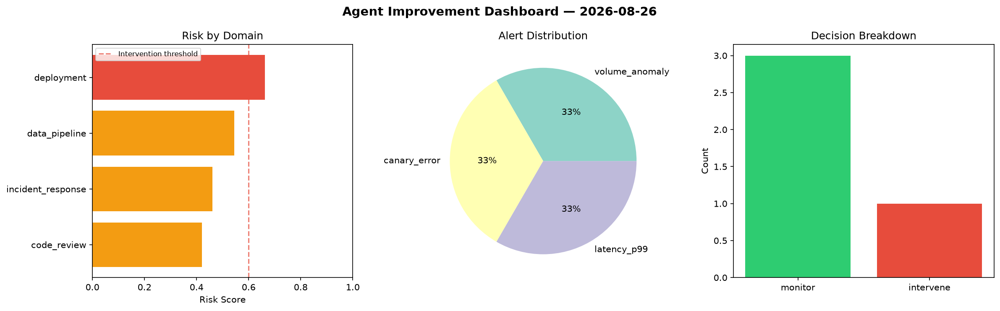
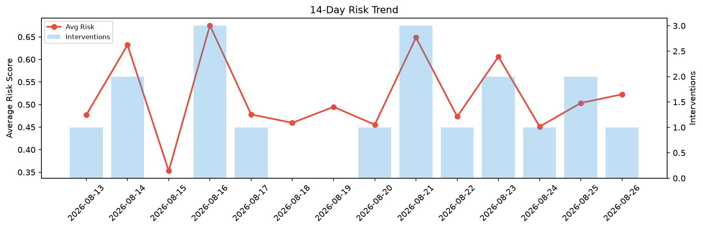

# Agent Improvement Report — 2026-08-26

**Cycle ID:** `a8e87e9b` | **Avg Risk:** 0.5227 | **Interventions:** 1/4

## Risk Matrix

| Domain | Risk Score | Decision | Alerts |
|--------|-----------|----------|--------|
| code_review | 0.4211 | monitor | none |
| incident_response | 0.4615 | monitor | none |
| data_pipeline | 0.5452 | monitor | volume_anomaly |
| deployment | 0.6631 | intervene | canary_error, latency_p99 |

## Delta vs Yesterday

| Domain | Today | Yesterday | Change |
|--------|-------|-----------|--------|
| code_review | 0.4211 | 0.1962 | 📈 114.6% |
| incident_response | 0.4615 | 0.6362 | 📉 -27.5% |
| data_pipeline | 0.5452 | 0.6225 | 📉 -12.4% |
| deployment | 0.6631 | 0.5589 | 📈 18.6% |

**Refinement:** `{'adjustment': 'tighten_thresholds', 'trend': 'degrading', 'window': 4}`