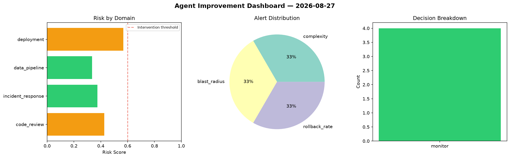
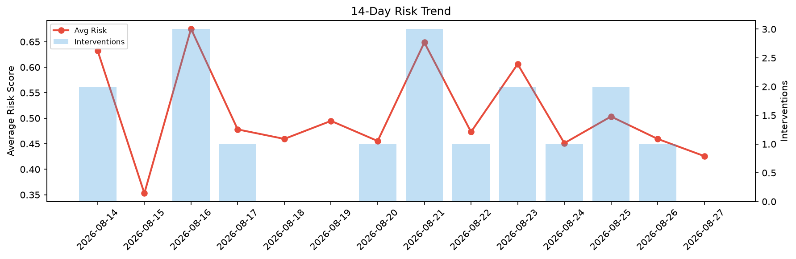

# Agent Improvement Report — 2026-08-27

**Cycle ID:** `6a6e58a6` | **Avg Risk:** 0.4258 | **Interventions:** 0/4

## Risk Matrix

| Domain | Risk Score | Decision | Alerts |
|--------|-----------|----------|--------|
| code_review | 0.4262 | monitor | complexity |
| incident_response | 0.3743 | monitor | blast_radius |
| data_pipeline | 0.3346 | monitor | none |
| deployment | 0.5682 | monitor | rollback_rate |

## Delta vs Yesterday

| Domain | Today | Yesterday | Change |
|--------|-------|-----------|--------|
| code_review | 0.4262 | 0.4813 | 📉 -11.4% |
| incident_response | 0.3743 | 0.1512 | 📈 147.6% |
| data_pipeline | 0.3346 | 0.4171 | 📉 -19.8% |
| deployment | 0.5682 | 0.7884 | 📉 -27.9% |

**Refinement:** `{'adjustment': 'tighten_thresholds', 'trend': 'degrading', 'window': 4}`