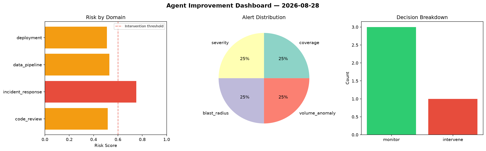
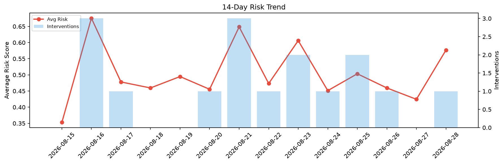

# Agent Improvement Report — 2026-08-28

**Cycle ID:** `5d50bc2e` | **Avg Risk:** 0.5766 | **Interventions:** 1/4

## Risk Matrix

| Domain | Risk Score | Decision | Alerts |
|--------|-----------|----------|--------|
| code_review | 0.516 | monitor | coverage |
| incident_response | 0.7513 | intervene | severity, blast_radius |
| data_pipeline | 0.5301 | monitor | volume_anomaly |
| deployment | 0.5088 | monitor | none |

## Delta vs Yesterday

| Domain | Today | Yesterday | Change |
|--------|-------|-----------|--------|
| code_review | 0.516 | 0.3578 | 📈 44.2% |
| incident_response | 0.7513 | 0.4722 | 📈 59.1% |
| data_pipeline | 0.5301 | 0.4479 | 📈 18.4% |
| deployment | 0.5088 | 0.4195 | 📈 21.3% |

**Refinement:** `{'adjustment': 'maintain', 'trend': 'improving', 'window': 4}`