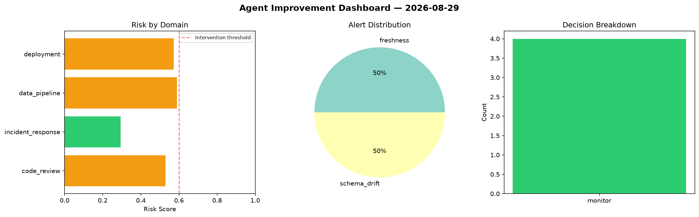
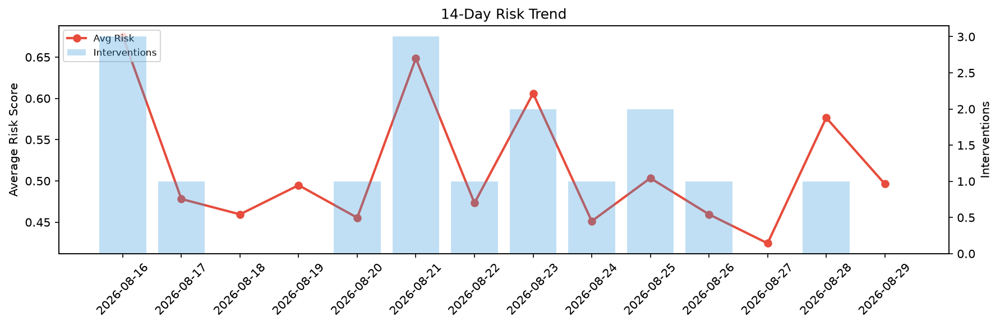

# Agent Improvement Report — 2026-08-29

**Cycle ID:** `0f2bdabe` | **Avg Risk:** 0.4963 | **Interventions:** 0/4

## Risk Matrix

| Domain | Risk Score | Decision | Alerts |
|--------|-----------|----------|--------|
| code_review | 0.5299 | monitor | none |
| incident_response | 0.2936 | monitor | none |
| data_pipeline | 0.5896 | monitor | freshness, schema_drift |
| deployment | 0.5722 | monitor | none |

## Delta vs Yesterday

| Domain | Today | Yesterday | Change |
|--------|-------|-----------|--------|
| code_review | 0.5299 | 0.516 | 📈 2.7% |
| incident_response | 0.2936 | 0.7513 | 📉 -60.9% |
| data_pipeline | 0.5896 | 0.5301 | 📈 11.2% |
| deployment | 0.5722 | 0.5088 | 📈 12.5% |

**Refinement:** `{'adjustment': 'tighten_thresholds', 'trend': 'degrading', 'window': 4}`