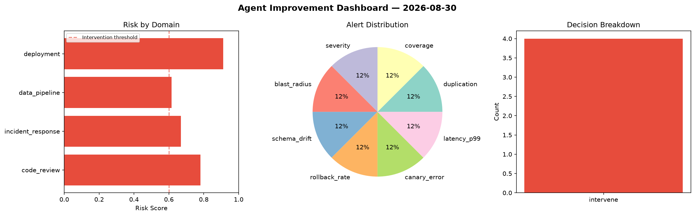
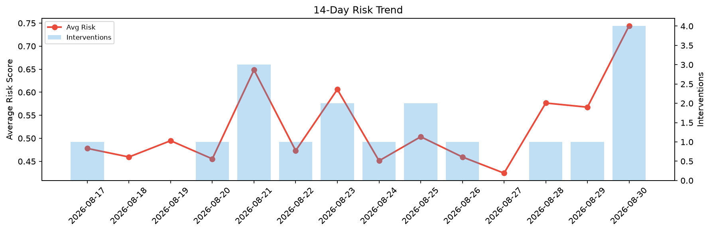

# Agent Improvement Report — 2026-08-30

**Cycle ID:** `797aa5b8` | **Avg Risk:** 0.7443 | **Interventions:** 4/4

## Risk Matrix

| Domain | Risk Score | Decision | Alerts |
|--------|-----------|----------|--------|
| code_review | 0.781 | intervene | duplication, coverage |
| incident_response | 0.6683 | intervene | severity, blast_radius |
| data_pipeline | 0.6155 | intervene | schema_drift |
| deployment | 0.9124 | intervene | rollback_rate, canary_error, latency_p99 |

## Delta vs Yesterday

| Domain | Today | Yesterday | Change |
|--------|-------|-----------|--------|
| code_review | 0.781 | 0.5603 | 📈 39.4% |
| incident_response | 0.6683 | 0.7049 | 📉 -5.2% |
| data_pipeline | 0.6155 | 0.536 | 📈 14.8% |
| deployment | 0.9124 | 0.4693 | 📈 94.4% |

**Refinement:** `{'adjustment': 'tighten_thresholds', 'trend': 'degrading', 'window': 4}`