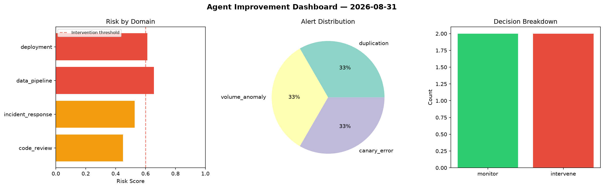
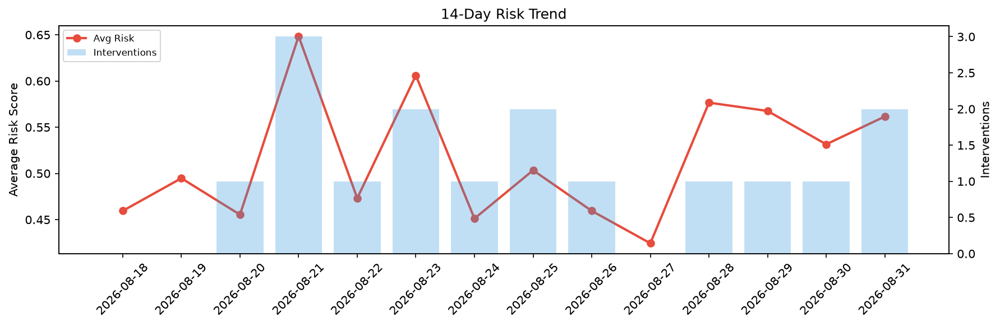

# Agent Improvement Report — 2026-08-31

**Cycle ID:** `188b6d58` | **Avg Risk:** 0.5616 | **Interventions:** 2/4

## Risk Matrix

| Domain | Risk Score | Decision | Alerts |
|--------|-----------|----------|--------|
| code_review | 0.4498 | monitor | duplication |
| incident_response | 0.5279 | monitor | none |
| data_pipeline | 0.6567 | intervene | volume_anomaly |
| deployment | 0.612 | intervene | canary_error |

## Delta vs Yesterday

| Domain | Today | Yesterday | Change |
|--------|-------|-----------|--------|
| code_review | 0.4498 | 0.7678 | 📉 -41.4% |
| incident_response | 0.5279 | 0.5829 | 📉 -9.4% |
| data_pipeline | 0.6567 | 0.3683 | 📈 78.3% |
| deployment | 0.612 | 0.4072 | 📈 50.3% |

**Refinement:** `{'adjustment': 'tighten_thresholds', 'trend': 'degrading', 'window': 4}`