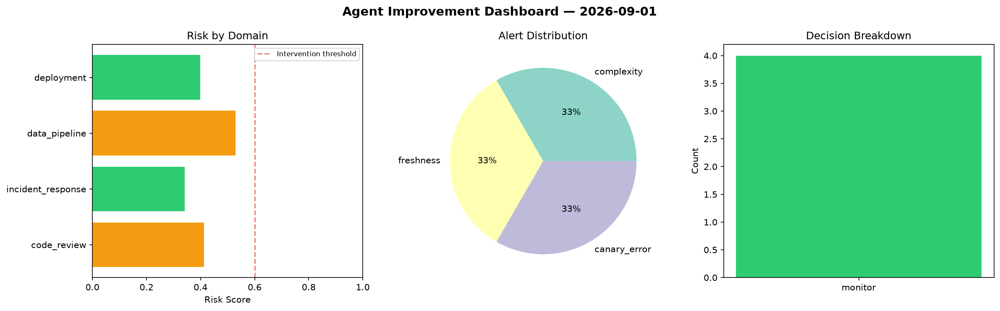
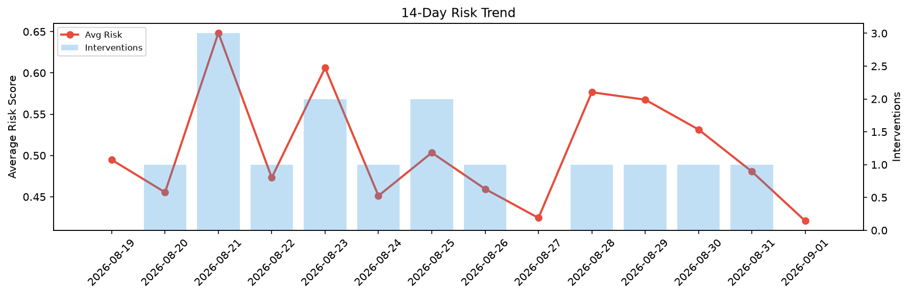

# Agent Improvement Report — 2026-09-01

**Cycle ID:** `f3418abe` | **Avg Risk:** 0.4208 | **Interventions:** 0/4

## Risk Matrix

| Domain | Risk Score | Decision | Alerts |
|--------|-----------|----------|--------|
| code_review | 0.4133 | monitor | complexity |
| incident_response | 0.3415 | monitor | none |
| data_pipeline | 0.5289 | monitor | freshness |
| deployment | 0.3994 | monitor | canary_error |

## Delta vs Yesterday

| Domain | Today | Yesterday | Change |
|--------|-------|-----------|--------|
| code_review | 0.4133 | 0.4803 | 📉 -13.9% |
| incident_response | 0.3415 | 0.4637 | 📉 -26.4% |
| data_pipeline | 0.5289 | 0.3038 | 📈 74.1% |
| deployment | 0.3994 | 0.6746 | 📉 -40.8% |

**Refinement:** `{'adjustment': 'maintain', 'trend': 'improving', 'window': 4}`