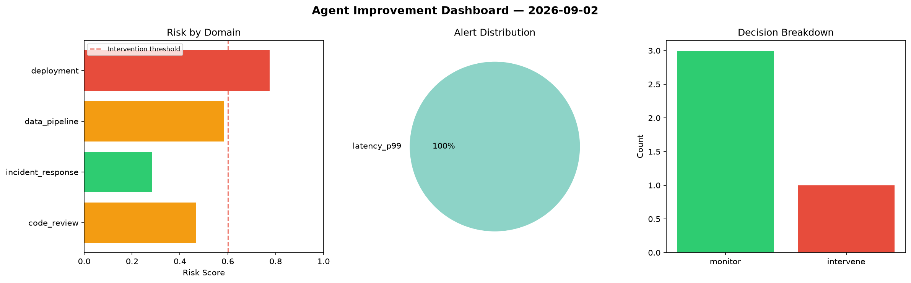
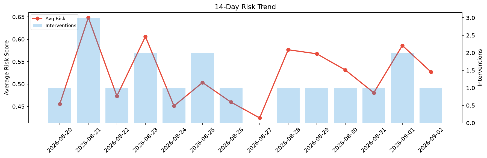

# Agent Improvement Report — 2026-09-02

**Cycle ID:** `0dc90677` | **Avg Risk:** 0.5272 | **Interventions:** 1/4

## Risk Matrix

| Domain | Risk Score | Decision | Alerts |
|--------|-----------|----------|--------|
| code_review | 0.4662 | monitor | none |
| incident_response | 0.2831 | monitor | none |
| data_pipeline | 0.5848 | monitor | none |
| deployment | 0.7749 | intervene | latency_p99 |

## Delta vs Yesterday

| Domain | Today | Yesterday | Change |
|--------|-------|-----------|--------|
| code_review | 0.4662 | 0.7192 | 📉 -35.2% |
| incident_response | 0.2831 | 0.4499 | 📉 -37.1% |
| data_pipeline | 0.5848 | 0.4372 | 📈 33.8% |
| deployment | 0.7749 | 0.7383 | 📈 5.0% |

**Refinement:** `{'adjustment': 'tighten_thresholds', 'trend': 'degrading', 'window': 4}`