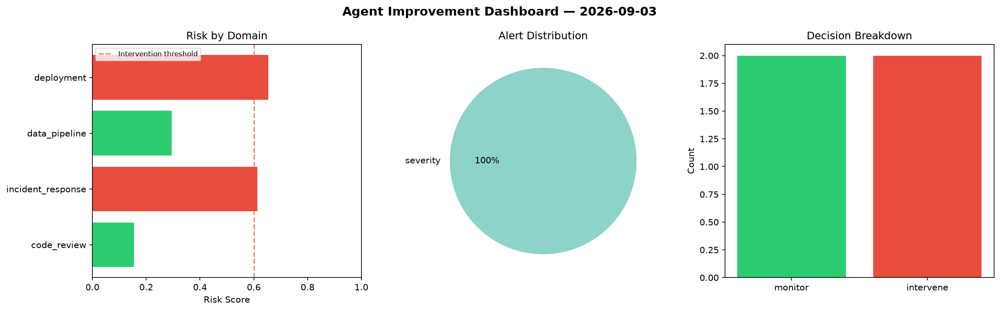
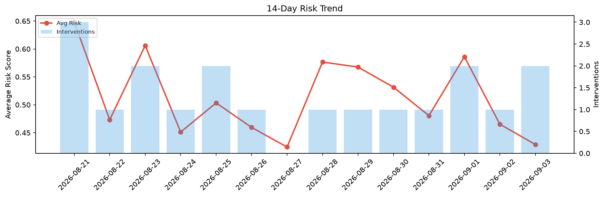

# Agent Improvement Report — 2026-09-03

**Cycle ID:** `f4e5192a` | **Avg Risk:** 0.4289 | **Interventions:** 2/4

## Risk Matrix

| Domain | Risk Score | Decision | Alerts |
|--------|-----------|----------|--------|
| code_review | 0.1544 | monitor | none |
| incident_response | 0.613 | intervene | severity |
| data_pipeline | 0.2947 | monitor | none |
| deployment | 0.6536 | intervene | none |

## Delta vs Yesterday

| Domain | Today | Yesterday | Change |
|--------|-------|-----------|--------|
| code_review | 0.1544 | 0.5903 | 📉 -73.8% |
| incident_response | 0.613 | 0.2737 | 📈 124.0% |
| data_pipeline | 0.2947 | 0.6118 | 📉 -51.8% |
| deployment | 0.6536 | 0.3853 | 📈 69.6% |

**Refinement:** `{'adjustment': 'tighten_thresholds', 'trend': 'degrading', 'window': 4}`