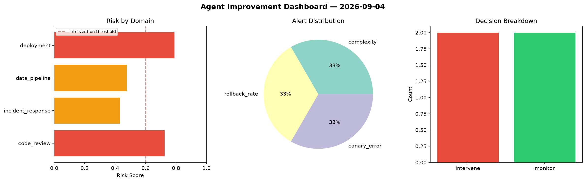
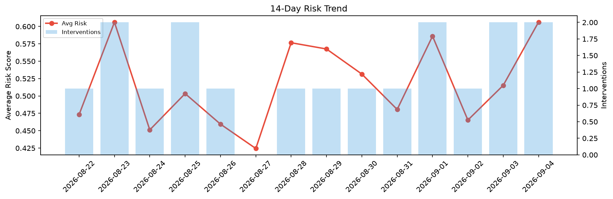

# Agent Improvement Report — 2026-09-04

**Cycle ID:** `8ef7db7c` | **Avg Risk:** 0.6063 | **Interventions:** 2/4

## Risk Matrix

| Domain | Risk Score | Decision | Alerts |
|--------|-----------|----------|--------|
| code_review | 0.7258 | intervene | complexity |
| incident_response | 0.4313 | monitor | none |
| data_pipeline | 0.4782 | monitor | none |
| deployment | 0.79 | intervene | rollback_rate, canary_error |

## Delta vs Yesterday

| Domain | Today | Yesterday | Change |
|--------|-------|-----------|--------|
| code_review | 0.7258 | 0.3569 | 📈 103.4% |
| incident_response | 0.4313 | 0.7445 | 📉 -42.1% |
| data_pipeline | 0.4782 | 0.6711 | 📉 -28.7% |
| deployment | 0.79 | 0.2888 | 📈 173.5% |

**Refinement:** `{'adjustment': 'tighten_thresholds', 'trend': 'degrading', 'window': 4}`