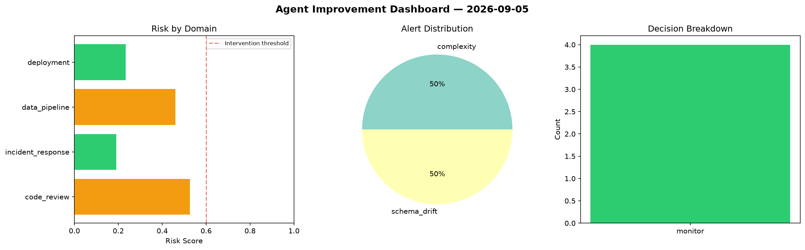
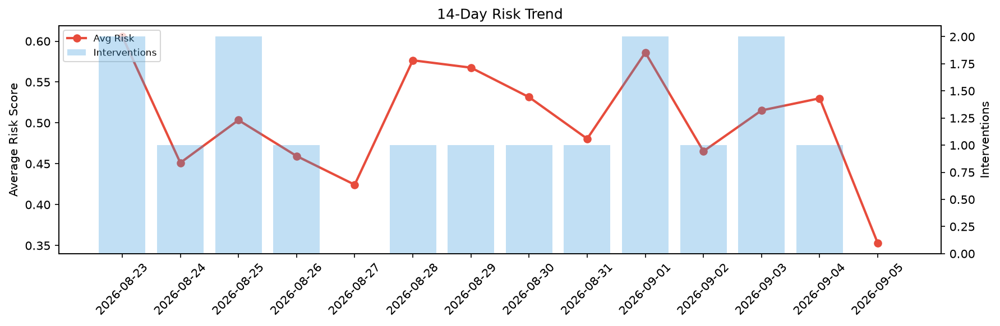

# Agent Improvement Report — 2026-09-05

**Cycle ID:** `d0dfa16b` | **Avg Risk:** 0.3527 | **Interventions:** 0/4

## Risk Matrix

| Domain | Risk Score | Decision | Alerts |
|--------|-----------|----------|--------|
| code_review | 0.5268 | monitor | complexity |
| incident_response | 0.1902 | monitor | none |
| data_pipeline | 0.4607 | monitor | schema_drift |
| deployment | 0.2332 | monitor | none |

## Delta vs Yesterday

| Domain | Today | Yesterday | Change |
|--------|-------|-----------|--------|
| code_review | 0.5268 | 0.5391 | 📉 -2.3% |
| incident_response | 0.1902 | 0.6138 | 📉 -69.0% |
| data_pipeline | 0.4607 | 0.4909 | 📉 -6.2% |
| deployment | 0.2332 | 0.4767 | 📉 -51.1% |

**Refinement:** `{'adjustment': 'maintain', 'trend': 'improving', 'window': 4}`