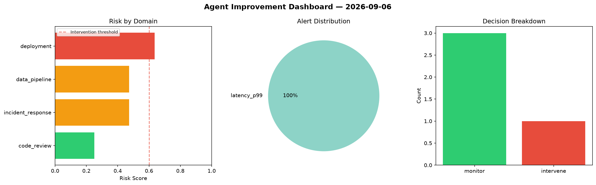
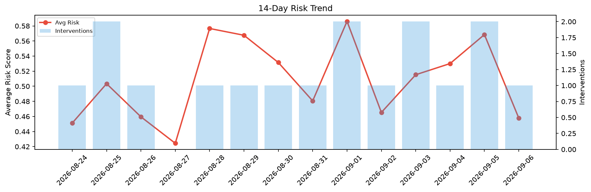

# Agent Improvement Report — 2026-09-06

**Cycle ID:** `6d82ca9e` | **Avg Risk:** 0.4578 | **Interventions:** 1/4

## Risk Matrix

| Domain | Risk Score | Decision | Alerts |
|--------|-----------|----------|--------|
| code_review | 0.2512 | monitor | none |
| incident_response | 0.4725 | monitor | none |
| data_pipeline | 0.4722 | monitor | none |
| deployment | 0.6355 | intervene | latency_p99 |

## Delta vs Yesterday

| Domain | Today | Yesterday | Change |
|--------|-------|-----------|--------|
| code_review | 0.2512 | 0.4507 | 📉 -44.3% |
| incident_response | 0.4725 | 0.8134 | 📉 -41.9% |
| data_pipeline | 0.4722 | 0.3143 | 📈 50.2% |
| deployment | 0.6355 | 0.6954 | 📉 -8.6% |

**Refinement:** `{'adjustment': 'tighten_thresholds', 'trend': 'degrading', 'window': 4}`