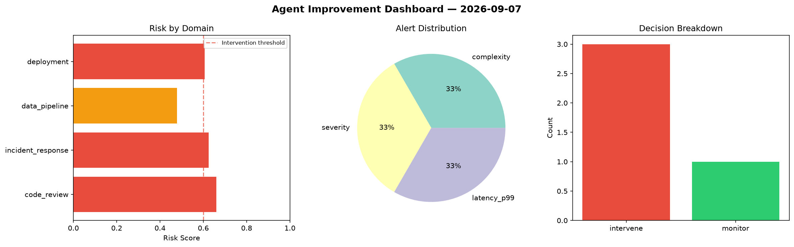
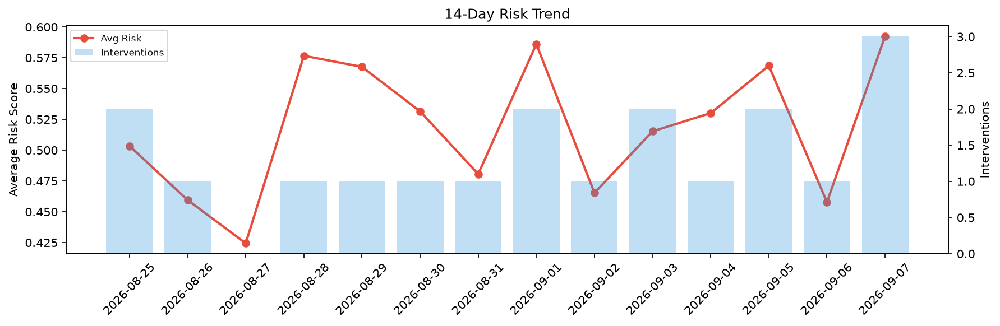

# Agent Improvement Report — 2026-09-07

**Cycle ID:** `8236363c` | **Avg Risk:** 0.5925 | **Interventions:** 3/4

## Risk Matrix

| Domain | Risk Score | Decision | Alerts |
|--------|-----------|----------|--------|
| code_review | 0.6605 | intervene | complexity |
| incident_response | 0.6245 | intervene | severity |
| data_pipeline | 0.478 | monitor | none |
| deployment | 0.607 | intervene | latency_p99 |

## Delta vs Yesterday

| Domain | Today | Yesterday | Change |
|--------|-------|-----------|--------|
| code_review | 0.6605 | 0.2512 | 📈 162.9% |
| incident_response | 0.6245 | 0.4725 | 📈 32.2% |
| data_pipeline | 0.478 | 0.4722 | 📈 1.2% |
| deployment | 0.607 | 0.6355 | 📉 -4.5% |

**Refinement:** `{'adjustment': 'maintain', 'trend': 'improving', 'window': 4}`