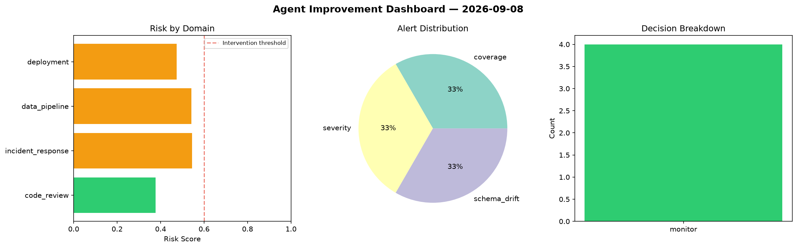
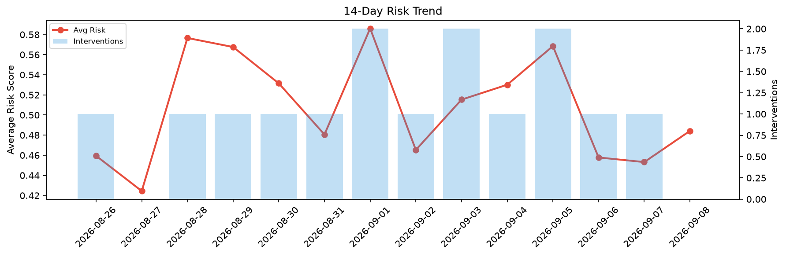

# Agent Improvement Report — 2026-09-08

**Cycle ID:** `9f83825f` | **Avg Risk:** 0.4842 | **Interventions:** 0/4

## Risk Matrix

| Domain | Risk Score | Decision | Alerts |
|--------|-----------|----------|--------|
| code_review | 0.3762 | monitor | coverage |
| incident_response | 0.5448 | monitor | severity |
| data_pipeline | 0.5417 | monitor | schema_drift |
| deployment | 0.474 | monitor | none |

## Delta vs Yesterday

| Domain | Today | Yesterday | Change |
|--------|-------|-----------|--------|
| code_review | 0.3762 | 0.7964 | 📉 -52.8% |
| incident_response | 0.5448 | 0.3178 | 📈 71.4% |
| data_pipeline | 0.5417 | 0.1466 | 📈 269.5% |
| deployment | 0.474 | 0.5521 | 📉 -14.1% |

**Refinement:** `{'adjustment': 'tighten_thresholds', 'trend': 'degrading', 'window': 4}`