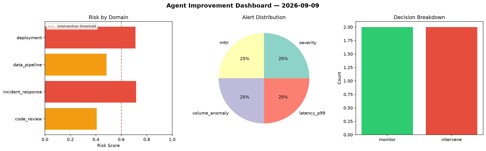
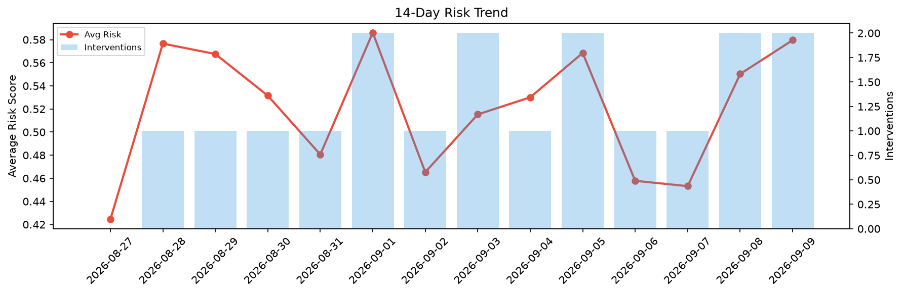

# Agent Improvement Report — 2026-09-09

**Cycle ID:** `88f45d10` | **Avg Risk:** 0.5796 | **Interventions:** 2/4

## Risk Matrix

| Domain | Risk Score | Decision | Alerts |
|--------|-----------|----------|--------|
| code_review | 0.4064 | monitor | none |
| incident_response | 0.7169 | intervene | severity, mttr |
| data_pipeline | 0.4837 | monitor | volume_anomaly |
| deployment | 0.7112 | intervene | latency_p99 |

## Delta vs Yesterday

| Domain | Today | Yesterday | Change |
|--------|-------|-----------|--------|
| code_review | 0.4064 | 0.4195 | 📉 -3.1% |
| incident_response | 0.7169 | 0.7152 | 📈 0.2% |
| data_pipeline | 0.4837 | 0.7131 | 📉 -32.2% |
| deployment | 0.7112 | 0.3534 | 📈 101.2% |

**Refinement:** `{'adjustment': 'tighten_thresholds', 'trend': 'degrading', 'window': 4}`