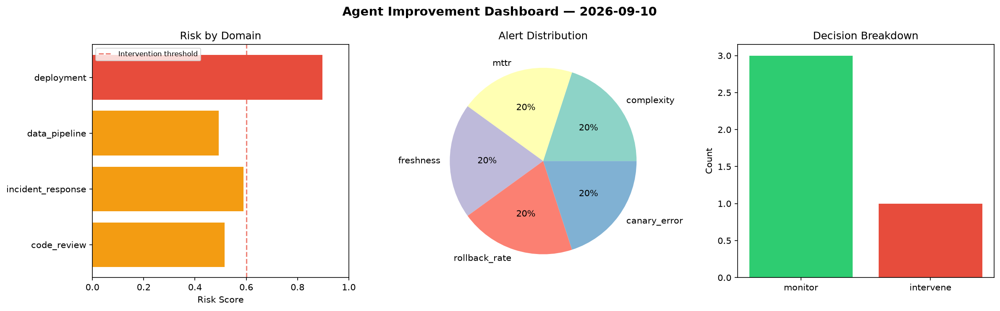
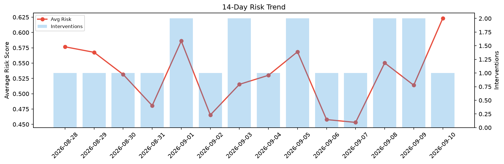

# Agent Improvement Report — 2026-09-10

**Cycle ID:** `28d8c28d` | **Avg Risk:** 0.6233 | **Interventions:** 1/4

## Risk Matrix

| Domain | Risk Score | Decision | Alerts |
|--------|-----------|----------|--------|
| code_review | 0.5149 | monitor | complexity |
| incident_response | 0.5893 | monitor | mttr |
| data_pipeline | 0.4921 | monitor | freshness |
| deployment | 0.8968 | intervene | rollback_rate, canary_error |

## Delta vs Yesterday

| Domain | Today | Yesterday | Change |
|--------|-------|-----------|--------|
| code_review | 0.5149 | 0.71 | 📉 -27.5% |
| incident_response | 0.5893 | 0.2181 | 📈 170.2% |
| data_pipeline | 0.4921 | 0.6485 | 📉 -24.1% |
| deployment | 0.8968 | 0.479 | 📈 87.2% |

**Refinement:** `{'adjustment': 'tighten_thresholds', 'trend': 'degrading', 'window': 4}`