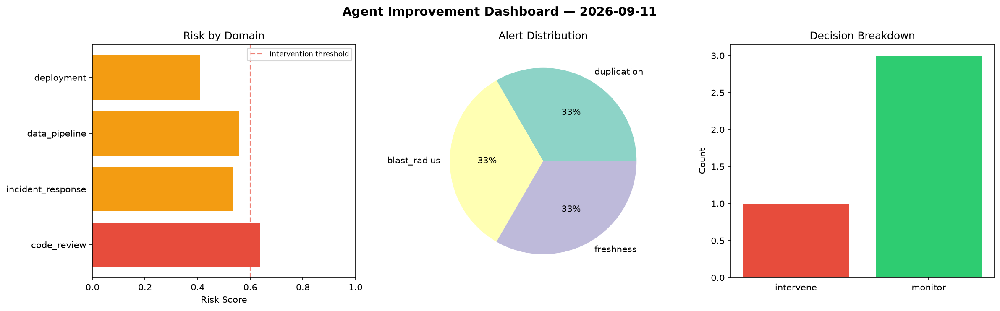
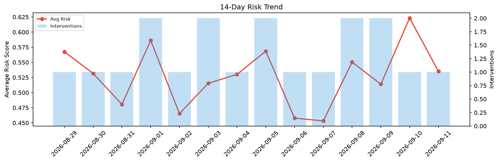

# Agent Improvement Report — 2026-09-11

**Cycle ID:** `b0ee6630` | **Avg Risk:** 0.5353 | **Interventions:** 1/4

## Risk Matrix

| Domain | Risk Score | Decision | Alerts |
|--------|-----------|----------|--------|
| code_review | 0.6364 | intervene | duplication |
| incident_response | 0.5353 | monitor | blast_radius |
| data_pipeline | 0.5589 | monitor | freshness |
| deployment | 0.4106 | monitor | none |

## Delta vs Yesterday

| Domain | Today | Yesterday | Change |
|--------|-------|-----------|--------|
| code_review | 0.6364 | 0.5149 | 📈 23.6% |
| incident_response | 0.5353 | 0.5893 | 📉 -9.2% |
| data_pipeline | 0.5589 | 0.4921 | 📈 13.6% |
| deployment | 0.4106 | 0.8968 | 📉 -54.2% |

**Refinement:** `{'adjustment': 'maintain', 'trend': 'improving', 'window': 4}`