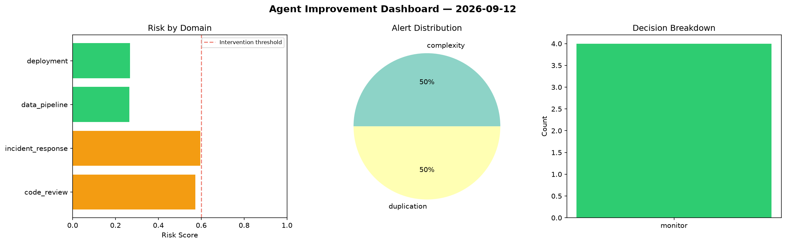
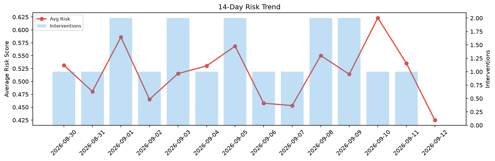

# Agent Improvement Report — 2026-09-12

**Cycle ID:** `daeae61e` | **Avg Risk:** 0.4249 | **Interventions:** 0/4

## Risk Matrix

| Domain | Risk Score | Decision | Alerts |
|--------|-----------|----------|--------|
| code_review | 0.5732 | monitor | complexity, duplication |
| incident_response | 0.5951 | monitor | none |
| data_pipeline | 0.2639 | monitor | none |
| deployment | 0.2676 | monitor | none |

## Delta vs Yesterday

| Domain | Today | Yesterday | Change |
|--------|-------|-----------|--------|
| code_review | 0.5732 | 0.6364 | 📉 -9.9% |
| incident_response | 0.5951 | 0.5353 | 📈 11.2% |
| data_pipeline | 0.2639 | 0.5589 | 📉 -52.8% |
| deployment | 0.2676 | 0.4106 | 📉 -34.8% |

**Refinement:** `{'adjustment': 'maintain', 'trend': 'improving', 'window': 4}`