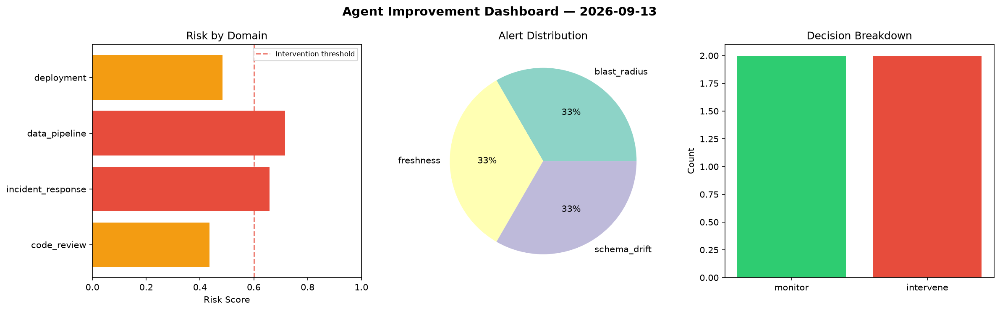
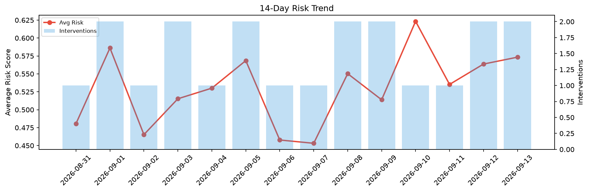

# Agent Improvement Report — 2026-09-13

**Cycle ID:** `0a599e9b` | **Avg Risk:** 0.5733 | **Interventions:** 2/4

## Risk Matrix

| Domain | Risk Score | Decision | Alerts |
|--------|-----------|----------|--------|
| code_review | 0.4347 | monitor | none |
| incident_response | 0.6591 | intervene | blast_radius |
| data_pipeline | 0.7161 | intervene | freshness, schema_drift |
| deployment | 0.4833 | monitor | none |

## Delta vs Yesterday

| Domain | Today | Yesterday | Change |
|--------|-------|-----------|--------|
| code_review | 0.4347 | 0.3615 | 📈 20.2% |
| incident_response | 0.6591 | 0.6626 | 📉 -0.5% |
| data_pipeline | 0.7161 | 0.3552 | 📈 101.6% |
| deployment | 0.4833 | 0.8755 | 📉 -44.8% |

**Refinement:** `{'adjustment': 'tighten_thresholds', 'trend': 'degrading', 'window': 4}`