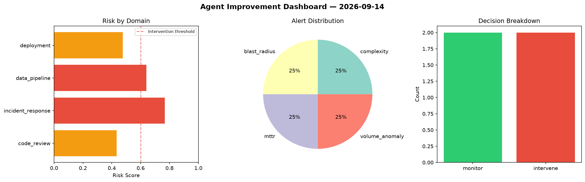
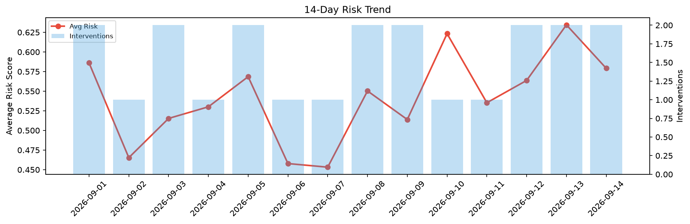

# Agent Improvement Report — 2026-09-14

**Cycle ID:** `7e06d571` | **Avg Risk:** 0.5792 | **Interventions:** 2/4

## Risk Matrix

| Domain | Risk Score | Decision | Alerts |
|--------|-----------|----------|--------|
| code_review | 0.4338 | monitor | complexity |
| incident_response | 0.7666 | intervene | blast_radius, mttr |
| data_pipeline | 0.6393 | intervene | volume_anomaly |
| deployment | 0.4771 | monitor | none |

## Delta vs Yesterday

| Domain | Today | Yesterday | Change |
|--------|-------|-----------|--------|
| code_review | 0.4338 | 0.7668 | 📉 -43.4% |
| incident_response | 0.7666 | 0.5466 | 📈 40.2% |
| data_pipeline | 0.6393 | 0.7741 | 📉 -17.4% |
| deployment | 0.4771 | 0.4505 | 📈 5.9% |

**Refinement:** `{'adjustment': 'tighten_thresholds', 'trend': 'degrading', 'window': 4}`