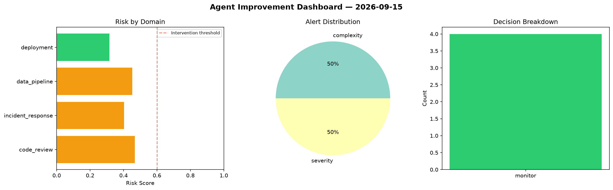
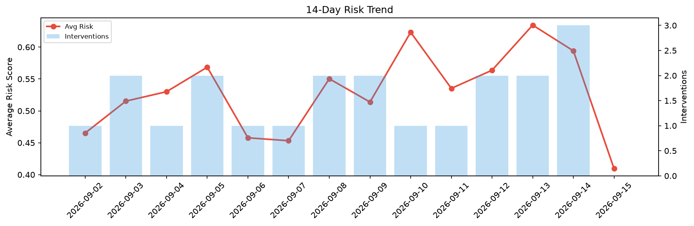

# Agent Improvement Report — 2026-09-15

**Cycle ID:** `c9f5e21e` | **Avg Risk:** 0.4094 | **Interventions:** 0/4

## Risk Matrix

| Domain | Risk Score | Decision | Alerts |
|--------|-----------|----------|--------|
| code_review | 0.467 | monitor | complexity |
| incident_response | 0.4025 | monitor | severity |
| data_pipeline | 0.4523 | monitor | none |
| deployment | 0.3158 | monitor | none |

## Delta vs Yesterday

| Domain | Today | Yesterday | Change |
|--------|-------|-----------|--------|
| code_review | 0.467 | 0.6587 | 📉 -29.1% |
| incident_response | 0.4025 | 0.676 | 📉 -40.5% |
| data_pipeline | 0.4523 | 0.6482 | 📉 -30.2% |
| deployment | 0.3158 | 0.3936 | 📉 -19.8% |

**Refinement:** `{'adjustment': 'maintain', 'trend': 'improving', 'window': 4}`