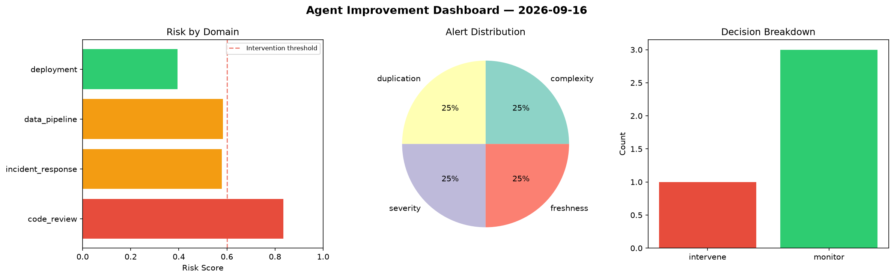
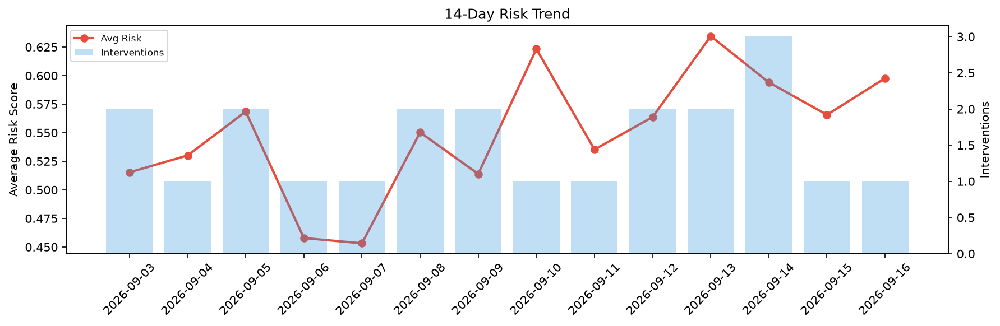

# Agent Improvement Report — 2026-09-16

**Cycle ID:** `6b0b0ad8` | **Avg Risk:** 0.5977 | **Interventions:** 1/4

## Risk Matrix

| Domain | Risk Score | Decision | Alerts |
|--------|-----------|----------|--------|
| code_review | 0.8346 | intervene | complexity, duplication |
| incident_response | 0.5788 | monitor | severity |
| data_pipeline | 0.5829 | monitor | freshness |
| deployment | 0.3946 | monitor | none |

## Delta vs Yesterday

| Domain | Today | Yesterday | Change |
|--------|-------|-----------|--------|
| code_review | 0.8346 | 0.5914 | 📈 41.1% |
| incident_response | 0.5788 | 0.6444 | 📉 -10.2% |
| data_pipeline | 0.5829 | 0.5902 | 📉 -1.2% |
| deployment | 0.3946 | 0.437 | 📉 -9.7% |

**Refinement:** `{'adjustment': 'maintain', 'trend': 'improving', 'window': 4}`