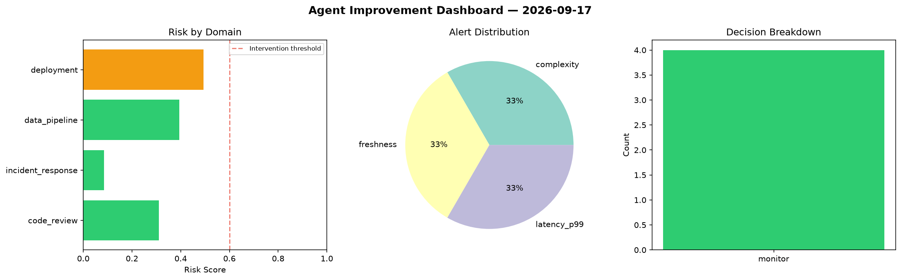
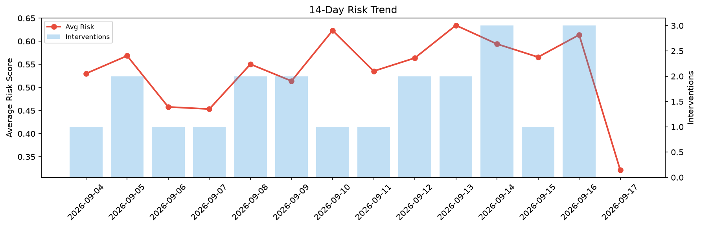

# Agent Improvement Report — 2026-09-17

**Cycle ID:** `66247dca` | **Avg Risk:** 0.3209 | **Interventions:** 0/4

## Risk Matrix

| Domain | Risk Score | Decision | Alerts |
|--------|-----------|----------|--------|
| code_review | 0.3108 | monitor | complexity |
| incident_response | 0.0851 | monitor | none |
| data_pipeline | 0.3944 | monitor | freshness |
| deployment | 0.4934 | monitor | latency_p99 |

## Delta vs Yesterday

| Domain | Today | Yesterday | Change |
|--------|-------|-----------|--------|
| code_review | 0.3108 | 0.7726 | 📉 -59.8% |
| incident_response | 0.0851 | 0.738 | 📉 -88.5% |
| data_pipeline | 0.3944 | 0.2551 | 📈 54.6% |
| deployment | 0.4934 | 0.6899 | 📉 -28.5% |

**Refinement:** `{'adjustment': 'tighten_thresholds', 'trend': 'degrading', 'window': 4}`