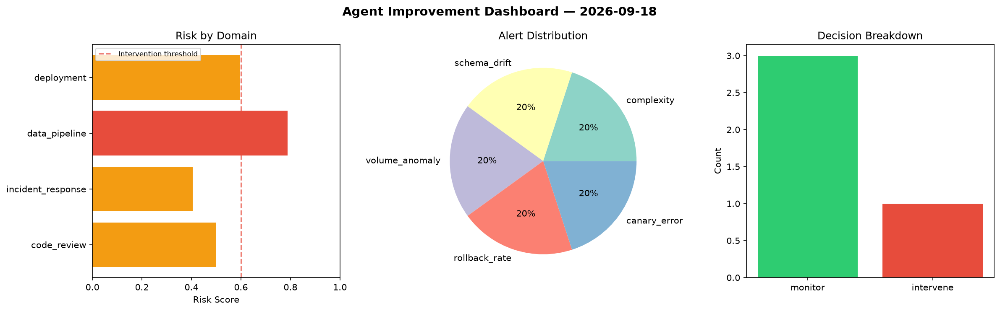
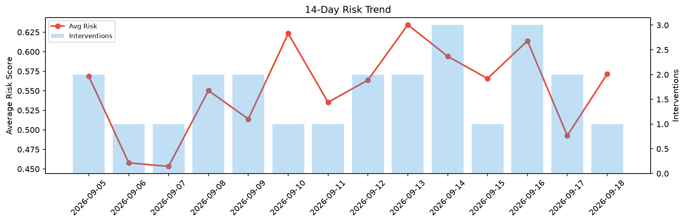

# Agent Improvement Report — 2026-09-18

**Cycle ID:** `ea627240` | **Avg Risk:** 0.5715 | **Interventions:** 1/4

## Risk Matrix

| Domain | Risk Score | Decision | Alerts |
|--------|-----------|----------|--------|
| code_review | 0.4978 | monitor | complexity |
| incident_response | 0.4045 | monitor | none |
| data_pipeline | 0.7886 | intervene | schema_drift, volume_anomaly |
| deployment | 0.5949 | monitor | rollback_rate, canary_error |

## Delta vs Yesterday

| Domain | Today | Yesterday | Change |
|--------|-------|-----------|--------|
| code_review | 0.4978 | 0.3541 | 📈 40.6% |
| incident_response | 0.4045 | 0.3112 | 📈 30.0% |
| data_pipeline | 0.7886 | 0.6949 | 📈 13.5% |
| deployment | 0.5949 | 0.6106 | 📉 -2.6% |

**Refinement:** `{'adjustment': 'tighten_thresholds', 'trend': 'degrading', 'window': 4}`