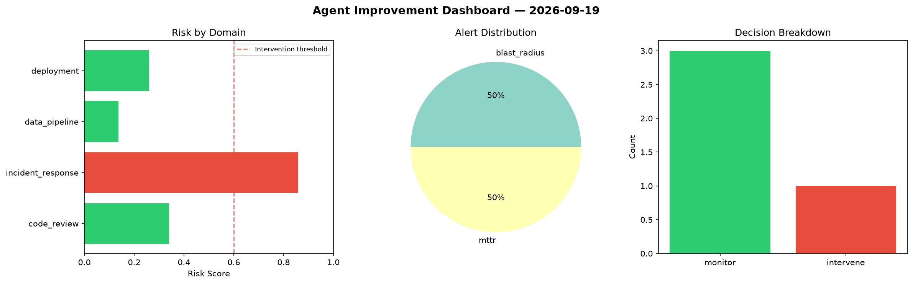
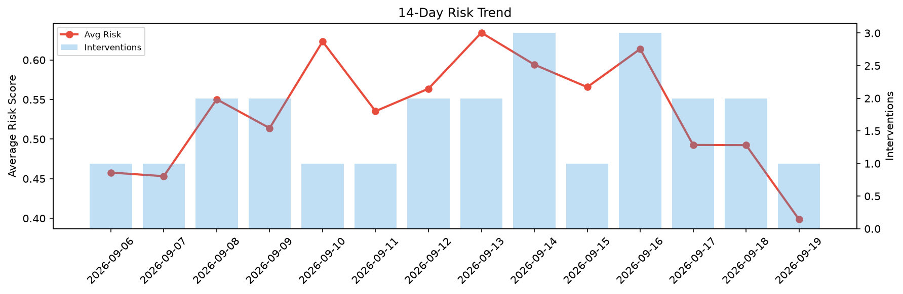

# Agent Improvement Report — 2026-09-19

**Cycle ID:** `f07ecc3b` | **Avg Risk:** 0.3986 | **Interventions:** 1/4

## Risk Matrix

| Domain | Risk Score | Decision | Alerts |
|--------|-----------|----------|--------|
| code_review | 0.3396 | monitor | none |
| incident_response | 0.8588 | intervene | blast_radius, mttr |
| data_pipeline | 0.1367 | monitor | none |
| deployment | 0.2594 | monitor | none |

## Delta vs Yesterday

| Domain | Today | Yesterday | Change |
|--------|-------|-----------|--------|
| code_review | 0.3396 | 0.2897 | 📈 17.2% |
| incident_response | 0.8588 | 0.6154 | 📈 39.6% |
| data_pipeline | 0.1367 | 0.6899 | 📉 -80.2% |
| deployment | 0.2594 | 0.375 | 📉 -30.8% |

**Refinement:** `{'adjustment': 'maintain', 'trend': 'improving', 'window': 4}`