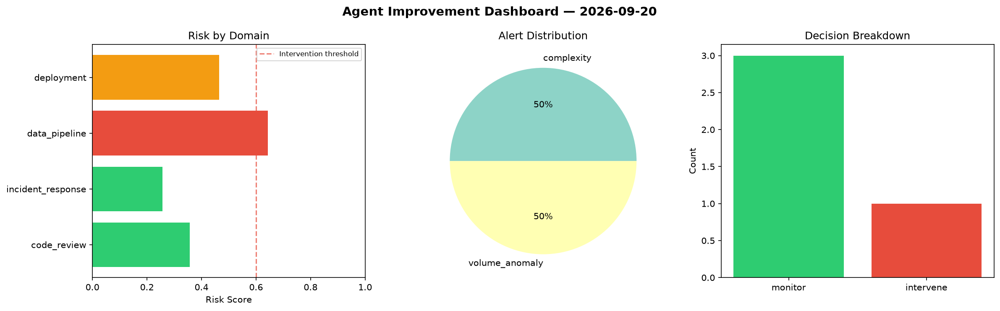
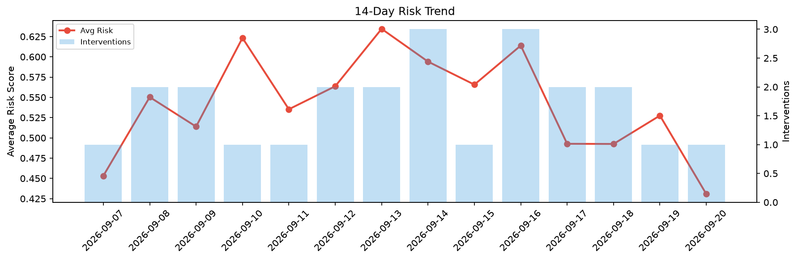

# Agent Improvement Report — 2026-09-20

**Cycle ID:** `49d2297d` | **Avg Risk:** 0.4307 | **Interventions:** 1/4

## Risk Matrix

| Domain | Risk Score | Decision | Alerts |
|--------|-----------|----------|--------|
| code_review | 0.3576 | monitor | complexity |
| incident_response | 0.2572 | monitor | none |
| data_pipeline | 0.643 | intervene | volume_anomaly |
| deployment | 0.465 | monitor | none |

## Delta vs Yesterday

| Domain | Today | Yesterday | Change |
|--------|-------|-----------|--------|
| code_review | 0.3576 | 0.5162 | 📉 -30.7% |
| incident_response | 0.2572 | 0.3858 | 📉 -33.3% |
| data_pipeline | 0.643 | 0.3703 | 📈 73.6% |
| deployment | 0.465 | 0.8378 | 📉 -44.5% |

**Refinement:** `{'adjustment': 'tighten_thresholds', 'trend': 'degrading', 'window': 4}`