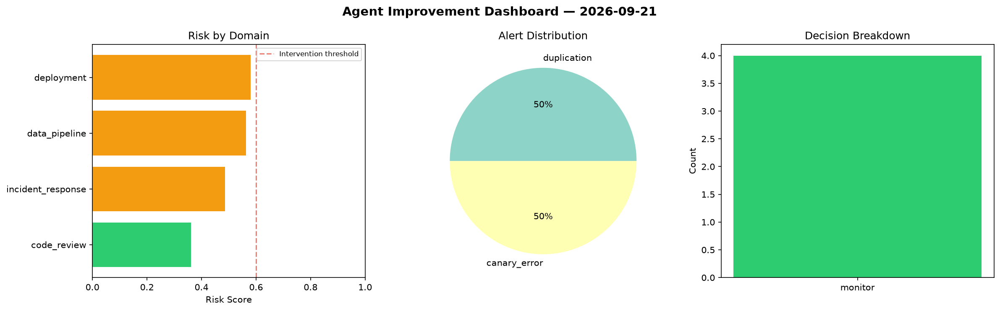
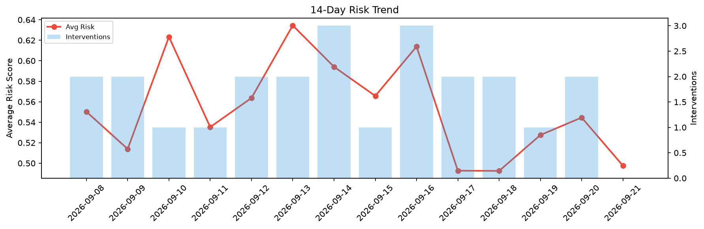

# Agent Improvement Report — 2026-09-21

**Cycle ID:** `dcadc43a` | **Avg Risk:** 0.4976 | **Interventions:** 0/4

## Risk Matrix

| Domain | Risk Score | Decision | Alerts |
|--------|-----------|----------|--------|
| code_review | 0.3614 | monitor | duplication |
| incident_response | 0.4861 | monitor | none |
| data_pipeline | 0.5633 | monitor | none |
| deployment | 0.5795 | monitor | canary_error |

## Delta vs Yesterday

| Domain | Today | Yesterday | Change |
|--------|-------|-----------|--------|
| code_review | 0.3614 | 0.6838 | 📉 -47.1% |
| incident_response | 0.4861 | 0.2985 | 📈 62.8% |
| data_pipeline | 0.5633 | 0.5541 | 📈 1.7% |
| deployment | 0.5795 | 0.642 | 📉 -9.7% |

**Refinement:** `{'adjustment': 'tighten_thresholds', 'trend': 'degrading', 'window': 4}`